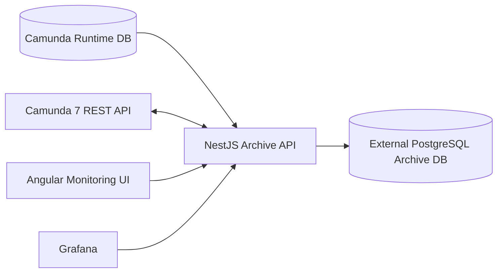

# Architecture

## Modules

- `camunda-api-module`: typed Camunda REST adapter for process, history, incident, variables, XML, start, and modification APIs.
- `archive-module`: archive repositories and services for completed, failed, and old suspended workflow history.
- `restore-module`: reconstruction-based restore service that creates new instances and moves executions through Camunda modification APIs.
- `scheduler-module`: node-cron schedules for archive, cleanup, consistency validation, and statistics.
- `workflow-module`: live and historic monitoring APIs.
- `incident-module`: Camunda incident monitoring APIs.
- `analytics-module`: dashboard counts, failure analytics, workflow trends, cleanup run summaries.
- `bpmn-viewer-module`: BPMN XML plus executed and failed activity timeline.

## Runtime Rules

- Do not archive active runtime workflows.
- Do not write to `ACT_RU_*` runtime tables.
- Preserve `SUPER_PROCESS_INSTANCE_ID_` and `ROOT_PROC_INST_ID_` in the archive.
- Restore parent workflows before child workflows.
- Keep archived history in duplicate Camunda-like `ARC_ACT_*` tables to simplify upgrade and restore behavior.
