# Camunda Data Archiving Project White Paper

Version: 1.0  
Project: Camunda External History Archive and Workflow Management System  
Audience: Architects, developers, technical leads, database administrators, and operations teams

## Table of Contents

1. [Executive Summary](#1-executive-summary)
2. [Background](#2-background)
3. [Existing System Architecture](#3-existing-system-architecture)
4. [Solution Architecture](#4-solution-architecture)
5. [Camunda Database Analysis](#5-camunda-database-analysis)
6. [Camunda History Tables](#6-camunda-history-tables)
7. [Camunda History Cleanup](#7-camunda-history-cleanup)
8. [Manual Archive Approach](#8-manual-archive-approach)
9. [Automatic Archive Approach](#9-automatic-archive-approach)
10. [Restore Process](#10-restore-process)
11. [Data Flow](#11-data-flow)
12. [Entity Relationship Diagram](#12-entity-relationship-diagram)
13. [Sequence Diagrams](#13-sequence-diagrams)
14. [Advantages of the Current Design](#14-advantages-of-the-current-design)
15. [Limitations](#15-limitations)
16. [Future Enhancements](#16-future-enhancements)
17. [References](#17-references)

## 1. Executive Summary

The Camunda Data Archiving project is an implemented archive and restore solution for Camunda 7 history data. It moves selected completed, failed, and old suspended workflow history from the primary Camunda PostgreSQL database into a separate Archive PostgreSQL database. The purpose is to reduce the size and operating load of the primary Camunda database while preserving the ability to re-sync archived history back into Camunda when required.

The system uses a NestJS API, an Angular operator UI, two PostgreSQL database connections, and Camunda REST integration. Archive and restore operations are implemented as controlled database movements between Camunda history tables and matching `arc_*` archive tables. The implementation intentionally avoids writing to Camunda runtime tables (`ACT_RU_*`), so restore is a history re-sync, not runtime process reconstruction.

The current implementation supports two operational approaches:

- Manual archiving, where an operator selects completed or failed process instances from the UI or API and archives them.
- Automatic archiving, where scheduled jobs select eligible completed, failed, or old suspended workflows and process them in the background.

The project documentation also describes a Camunda History Cleanup based approach. In the current codebase, direct delete-after-copy is implemented for archive movement, while the Camunda History Cleanup call is represented as a scheduler placeholder for estates that want Camunda-managed deletion after archive validation.

Expected outcomes are:

- Reduced primary Camunda history table volume.
- Faster Camunda history queries and operational screens.
- Lower pressure on Camunda history cleanup.
- A recoverable archive copy of historical workflow data.
- Clear auditability through archive runs, scheduler jobs, restore logs, and item-level retry history.

## 2. Background

Camunda 7 writes workflow execution history into `ACT_HI_*` tables. These tables grow quickly in estates with high workflow throughput because every completed process can generate process records, activity records, task records, variable records, form details, identity links, incidents, job logs, comments, attachments, decision history, and binary payload references.

Large history tables create several operational challenges:

- Historic process, task, and variable queries become slower as indexes and table scans grow.
- Camunda Cockpit, reporting APIs, and custom dashboards spend more time reading old data.
- Database maintenance becomes heavier because indexes, vacuum, backups, and restore operations must process more data.
- History cleanup jobs can take longer and may compete with production workload.
- Long retention periods make the primary database a reporting archive even though it is also the operational engine database.

This project separates those concerns. The Camunda database remains the operational source for active and recently completed history. The Archive database becomes the long-term storage and restore source for completed historical records.

## 3. Existing System Architecture

Figure 1 shows the implemented high-level architecture.

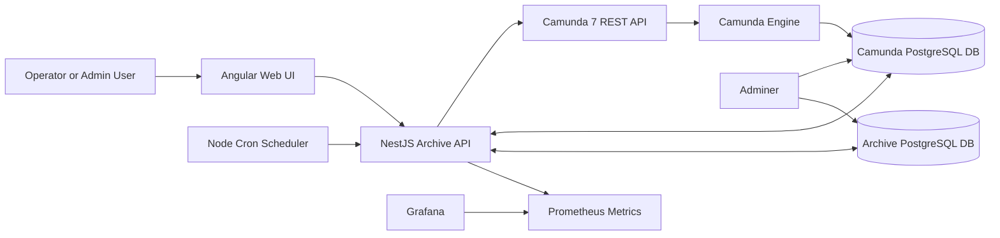

Figure 1: Current system architecture.

The main deployed components are:

| Component | Responsibility |
| --- | --- |
| Angular Web UI | Operator dashboard, workflow monitoring, selected archive, archived workflow search, restore/re-sync operations, incident monitoring, and scheduler views. |
| NestJS API | Central service layer for authentication, workflow monitoring, archive, restore, scheduler, analytics, health, metrics, and BPMN viewer APIs. |
| Camunda 7 REST API | Used for historic workflow reads, incidents, BPMN XML, process definition deployment, process start, process modification, and comments. |
| Camunda PostgreSQL DB | Primary engine database containing repository, runtime, history, identity, and engine metadata tables. |
| Archive PostgreSQL DB | External archive store containing mirrored `arc_*` history tables, archive run metadata, scheduler jobs, restore logs, audit logs, and workflow notes. |
| Node Cron Scheduler | Runs recurring archive jobs and due job processing. Contains a placeholder for Camunda History Cleanup integration. |
| Prometheus and Grafana | Metrics exposure and dashboard shell. |
| Adminer | Local database inspection for both PostgreSQL databases. |

The API owns two database pools:

| Pool | Injection Token | Purpose |
| --- | --- | --- |
| Camunda DB | `CAMUNDA_DB` | Reads and removes eligible rows from Camunda history tables. |
| Archive DB | `ARCHIVE_DB` | Stores archive tables, archive runs, restore logs, scheduler jobs, and archive search data. |

## 4. Solution Architecture

The implemented solution is a history movement architecture. It does not change Camunda runtime execution. It operates only after history has been written.

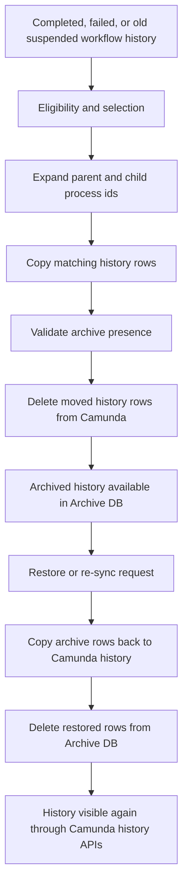

Figure 2: Archive and restore lifecycle.

Key design decisions:

- Archive tables mirror Camunda history tables with `arc_` prefixes.
- Archive metadata columns are added to archive rows: `archived_at`, `archive_run_id`, and `soft_deleted_at`.
- The archive service copies only columns that exist in the destination table, which helps the system tolerate minor Camunda schema differences.
- Parent and child process history can be processed together through `SUPER_PROCESS_INSTANCE_ID_` traversal.
- `ACT_GE_BYTEARRAY` rows are included only when referenced by archived variables, details, job logs, decision inputs/outputs, external task logs, or attachments.
- Archive and restore use transactions on both databases and delete source rows only after copy operations succeed.
- Restore preserves the original process instance id. It does not create a new Camunda runtime process instance.

## 5. Camunda Database Analysis

Camunda 7 groups database tables by prefix.

| Prefix | Category | Role |
| --- | --- | --- |
| `ACT_RE_*` | Repository | Process definitions, deployments, decision definitions, models, forms, and deployment resources. |
| `ACT_RU_*` | Runtime | Active executions, active tasks, variables, jobs, timers, incidents, subscriptions, batches, and runtime identity links. |
| `ACT_HI_*` | History | Historic process, activity, task, variable, detail, incident, job, decision, case, batch, comment, attachment, operation, and identity data. |
| `ACT_GE_*` | General | Shared engine metadata and binary data, especially `ACT_GE_BYTEARRAY`. |
| `ACT_ID_*` | Identity | Users, groups, memberships, tenants, and identity metadata. |

### Runtime and History Lifecycle

During execution, Camunda stores active state in runtime tables. When execution progresses or completes, Camunda writes history rows according to the configured history level.

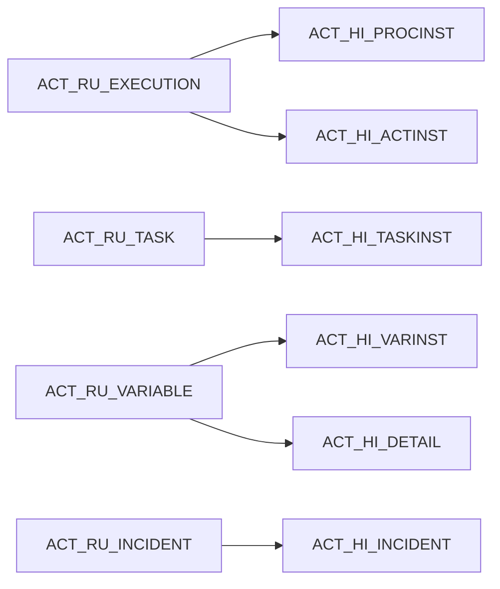

Figure 3: Runtime-to-history mapping.

The archiving project targets history data. Runtime tables are explicitly outside the archive and restore scope.

### Main Relationships

Most process-scoped history tables relate to the process instance through `PROC_INST_ID_`, `ROOT_PROC_INST_ID_`, or `PROCESS_INSTANCE_ID_`. Task-related rows may also use `TASK_ID_`. Decision input and output tables relate to `ACT_HI_DECINST` through `DEC_INST_ID_`. Binary payloads are stored in `ACT_GE_BYTEARRAY` and referenced by fields such as `BYTEARRAY_ID_`, `JOB_EXCEPTION_STACK_ID_`, `ERROR_DETAILS_ID_`, and `CONTENT_ID_`.

The current archive repository uses table-specific predicates to locate all related rows for a process selection.

## 6. Camunda History Tables

The current implementation supports the following Camunda-to-archive table mappings.

| Camunda Table | Archive Table | Purpose | Archive Consideration | Restore Consideration |
| --- | --- | --- | --- | --- |
| `act_hi_procinst` | `arc_act_hi_procinst` | Historic process instance root record. | Primary selector for workflow archive and archive search. Preserves state, start/end time, parent, root, and removal time fields. | Restored first-class history visibility depends on this row returning to Camunda. |
| `act_hi_actinst` | `arc_act_hi_actinst` | Historic activity execution timeline. | Copied by `proc_inst_id_`; includes task and call activity references. | Restores BPMN execution timeline. |
| `act_hi_taskinst` | `arc_act_hi_taskinst` | Historic user tasks. | Copied by `proc_inst_id_`; completed task validation checks unfinished tasks for completed archive mode. | Restores task history visibility. |
| `act_hi_varinst` | `arc_act_hi_varinst` | Latest historic variable values. | Copied by `proc_inst_id_`; byte array references are used to include serialized values. | Restores variable history values where target columns exist. |
| `act_hi_detail` | `arc_act_hi_detail` | Variable updates and form/property details. | Copied by `proc_inst_id_`; byte array references are included. | Restores detailed audit trail. |
| `act_hi_identitylink` | `arc_act_hi_identitylink` | Historic user/group associations. | Copied by process/root/task relationship depending on available columns. | Restores participant and assignment history. |
| `act_hi_decinst` | `arc_act_hi_decinst` | Historic decision instances. | Copied by process relationship. | Required before decision input/output rows make sense. |
| `act_hi_dec_in` | `arc_act_hi_dec_in` | Decision input values. | Copied by `dec_inst_id_` discovered from archived decision instances. | Restores DMN input audit. |
| `act_hi_dec_out` | `arc_act_hi_dec_out` | Decision output values. | Copied by `dec_inst_id_` discovered from archived decision instances. | Restores DMN output audit. |
| `act_hi_batch` | `arc_act_hi_batch` | Historic batch metadata. | Copied by batch id referenced from operation logs. | Restores batch audit where applicable. |
| `act_hi_incident` | `arc_act_hi_incident` | Historic incident records. | Copied by `proc_inst_id_` or root relationship. | Restores failure and incident investigation history. |
| `act_hi_job_log` | `arc_act_hi_job_log` | Historic job execution logs. | Uses `process_instance_id_` predicate. Exception stack references include byte arrays. | Restores job audit details. |
| `act_hi_ext_task_log` | `arc_act_hi_ext_task_log` | Historic external task logs. | Error details byte array references are included. | Restores external worker audit. |
| `act_hi_caseinst` | `arc_act_hi_caseinst` | Historic CMMN case instances. | Included when process rows reference case ids. | Restores case history where used. |
| `act_hi_caseactinst` | `arc_act_hi_caseactinst` | Historic CMMN case activity instances. | Included by related case ids. | Restores case activity timeline. |
| `act_hi_casetaskinst` | `arc_act_hi_casetaskinst` | Historic CMMN case task instances. | Included by related case ids. | Restores case task history. |
| `act_ge_bytearray` | `arc_act_ge_bytearray` | Binary payloads for serialized variables, attachments, exception stacks, and other large values. | Copied only when referenced by selected history. | Required for complete restoration of binary-backed values. |
| `act_hi_op_log` | `arc_act_hi_op_log` | User operation log. | Copied by process, root, task, or related identifiers. | Restores administrative audit entries. |
| `act_hi_attachment` | `arc_act_hi_attachment` | Historic attachments. | Content byte array references are included. | Restores attachment metadata and content references. |
| `act_hi_comment` | `arc_act_hi_comment` | Historic task/process comments. | Copied by process or task relationship. | Restores collaboration history. |

Tables without a complete history equivalent, such as repository tables, identity tables, runtime event subscriptions, timers, active jobs, filters, and engine properties, are not reconstructed by this project.

## 7. Camunda History Cleanup

Camunda History Cleanup is Camunda's built-in mechanism for deleting expired history. It deletes only history data; it does not delete runtime data.

History cleanup is controlled by:

- History Time To Live (TTL) on process, decision, or case definitions.
- `REMOVAL_TIME_` values on historic records when removal-time strategy is used.
- Cleanup batch window configuration.
- Background Job Executor execution.
- REST or Java API calls that create cleanup jobs.

Typical Camunda cleanup flow:

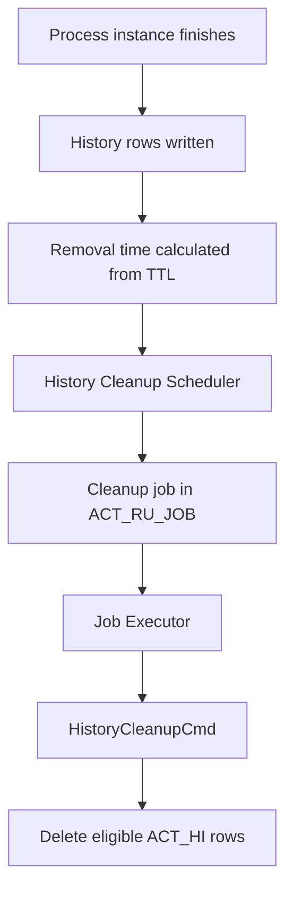

Figure 4: Camunda History Cleanup workflow.

The REST endpoint:

```http
POST /engine-rest/history/cleanup?immediatelyDue=true
```

creates a cleanup job. The response is a job description, not proof that rows have already been deleted. The Job Executor deletes rows asynchronously.

Important constraints:

- History Cleanup deletes all eligible records according to removal time and TTL rules.
- It does not accept a single process instance id as a cleanup filter.
- It does not know which records were archived unless the archive solution controls the eligible removal times.
- It does not produce a complete database audit of deleted row ids.

### Current Project Integration

The current implemented archive path copies selected history into archive tables and then deletes the moved rows directly from Camunda history tables inside the archive transaction flow.

The scheduler includes a daily `cleanupCamundaHistory()` placeholder that logs that Camunda cleanup APIs should be called after archive validation. This means Camunda History Cleanup integration is documented and reserved, but not the active deletion mechanism in the current implementation.

For an estate that chooses the cleanup-managed approach, the correct lifecycle is:

1. Select eligible completed history.
2. Copy all related history to the Archive database.
3. Validate archive completeness.
4. Make the archived instances eligible for cleanup, usually by removal time strategy or supported Camunda removal-time APIs.
5. Trigger Camunda History Cleanup.
6. Confirm cleanup job execution through job logs and engine logs.

## 8. Manual Archive Approach

Manual archive is initiated by an operator from the UI or API.

API entry point:

```http
POST /api/archive/run/selected
```

Request shape:

```json
{
  "mode": "COMPLETED",
  "processInstanceIds": ["623a3e07-54d4-11f1-940b-0242ac120006"]
}
```

Manual archive workflow:

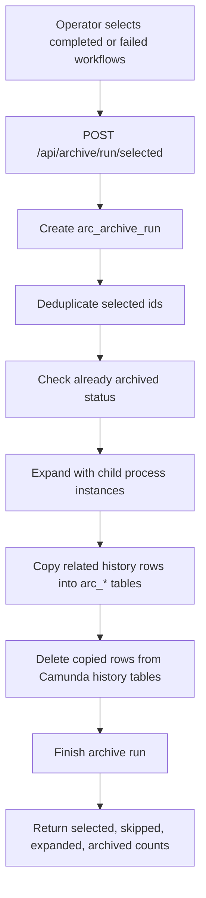

Figure 5: Manual archive activity diagram.

Validation and error handling:

- Already archived selected ids are skipped.
- Empty process selections produce no copied rows.
- Copy and delete operations run inside explicit database transactions.
- Source rows are deleted only after copy operations complete.
- `on conflict do nothing` prevents duplicate archive insert failures.
- Archive run status becomes `COMPLETED` or `FAILED` in `arc_archive_run`.
- Errors are logged and surfaced through the API response path.

## 9. Automatic Archive Approach

Automatic archiving is implemented through scheduler jobs and recurring cron jobs.

Recurring archive schedules:

| Schedule | Mode | Default Retention Selector |
| --- | --- | --- |
| Every 15 minutes | Completed workflows | `ARCHIVE_COMPLETED_OLDER_THAN_DAYS`, default 7 days. |
| Every 30 minutes | Failed workflows | `ARCHIVE_FAILED_OLDER_THAN_DAYS`, default 1 day. |
| Every 6 hours | Old suspended workflows | `ARCHIVE_SUSPENDED_OLDER_THAN_DAYS`, default 30 days. |
| Every minute | Due scheduler jobs | Runs one due `archive_job`. |
| Every 6 hours plus 15 minutes | Consistency validation placeholder | Logs placeholder execution. |
| Daily at 02:30 | Camunda cleanup placeholder | Logs that cleanup APIs should be called after archive validation. |

Automatic archive flow:

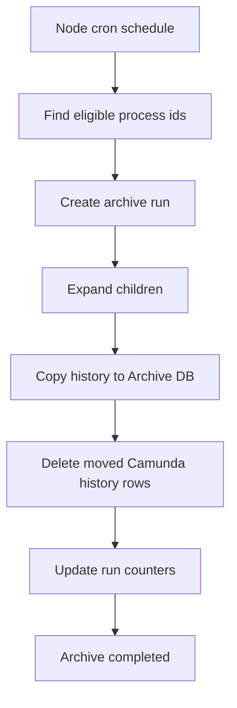

Figure 6: Automatic archive flow.

Operator-created scheduler jobs are stored in:

- `archive_job`
- `archive_job_item`
- `archive_job_retry_history`

These records provide job status, selected workflow count, eligible workflow count, completed count, failed count, pending count, retry count, timestamps, and item-level errors.

The scheduler processes jobs item by item. A failed workflow item does not stop the entire job. Failed items can be retried through the scheduler retry API.

## 10. Restore Process

Restore is implemented as history re-sync. It moves archived rows back into the original Camunda history tables and removes the restored rows from archive tables.

API entry points:

```http
POST /api/restore/workflow
POST /api/restore/workflows
```

Single restore request:

```json
{
  "processInstanceId": "623a3e07-54d4-11f1-940b-0242ac120006",
  "reason": "Operator requested re-sync from archive",
  "includeChildren": true
}
```

Restore workflow:

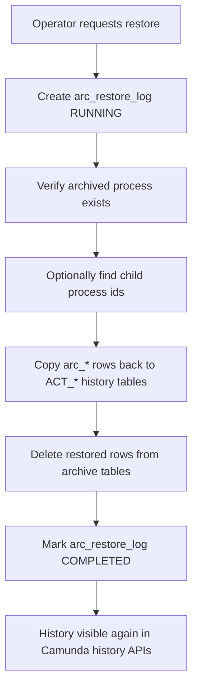

Figure 7: Restore activity diagram.

Restore characteristics:

- Original process instance ids are preserved.
- Restore does not start a new process instance.
- Restore does not write to `ACT_RU_*` runtime tables.
- Archive metadata columns are excluded during restore.
- Destination columns are discovered dynamically and only matching columns are inserted.
- `on conflict do nothing` avoids duplicate-key failures during repeated operator actions.
- The archive source rows are deleted only after the copy back to Camunda succeeds.

## 11. Data Flow

### Archive Data Flow

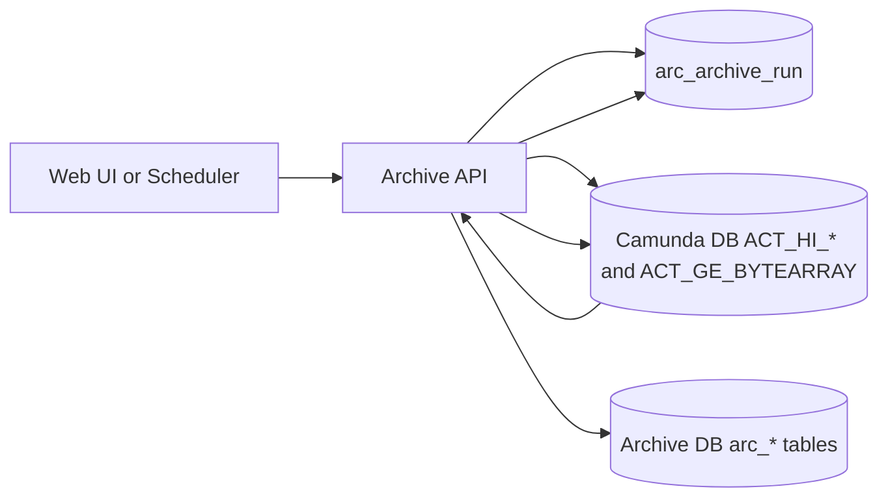

Figure 8: Archive data flow.

### Restore Data Flow

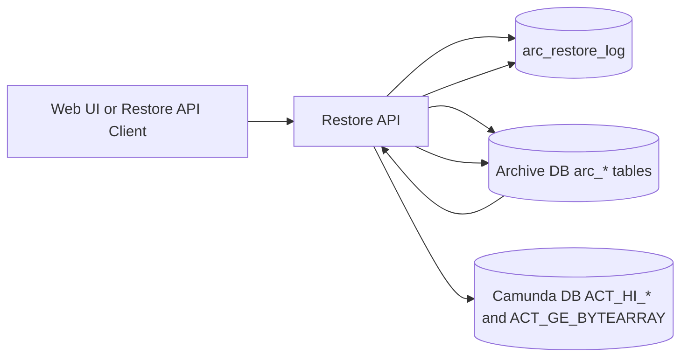

Figure 9: Restore data flow.

### History Cleanup Managed Variant

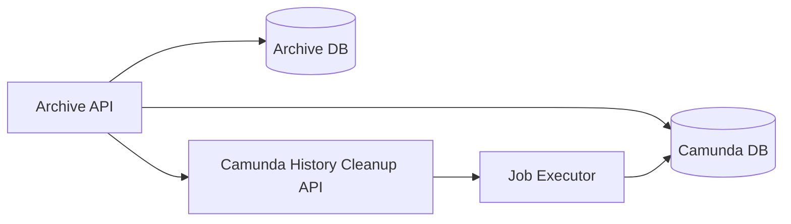

Figure 10: Optional cleanup-managed deletion variant.

## 12. Entity Relationship Diagram

```mermaid
erDiagram
  ACT_HI_PROCINST ||--o{ ACT_HI_ACTINST : "PROC_INST_ID_"
  ACT_HI_PROCINST ||--o{ ACT_HI_TASKINST : "PROC_INST_ID_"
  ACT_HI_PROCINST ||--o{ ACT_HI_VARINST : "PROC_INST_ID_"
  ACT_HI_PROCINST ||--o{ ACT_HI_DETAIL : "PROC_INST_ID_"
  ACT_HI_PROCINST ||--o{ ACT_HI_INCIDENT : "PROC_INST_ID_"
  ACT_HI_PROCINST ||--o{ ACT_HI_JOB_LOG : "PROCESS_INSTANCE_ID_"
  ACT_HI_PROCINST ||--o{ ACT_HI_COMMENT : "PROC_INST_ID_"
  ACT_HI_PROCINST ||--o{ ACT_HI_ATTACHMENT : "PROC_INST_ID_"
  ACT_HI_PROCINST ||--o{ ACT_HI_OP_LOG : "PROC_INST_ID_"
  ACT_HI_TASKINST ||--o{ ACT_HI_COMMENT : "TASK_ID_"
  ACT_HI_TASKINST ||--o{ ACT_HI_ATTACHMENT : "TASK_ID_"
  ACT_HI_DECINST ||--o{ ACT_HI_DEC_IN : "DEC_INST_ID_"
  ACT_HI_DECINST ||--o{ ACT_HI_DEC_OUT : "DEC_INST_ID_"
  ACT_GE_BYTEARRAY ||--o{ ACT_HI_VARINST : "BYTEARRAY_ID_"
  ACT_GE_BYTEARRAY ||--o{ ACT_HI_DETAIL : "BYTEARRAY_ID_"
  ACT_GE_BYTEARRAY ||--o{ ACT_HI_JOB_LOG : "JOB_EXCEPTION_STACK_ID_"
  ARC_ARCHIVE_RUN ||--o{ ARC_ACT_HI_PROCINST : "ARCHIVE_RUN_ID"
  ARC_ARCHIVE_RUN ||--o{ ARC_ACT_HI_ACTINST : "ARCHIVE_RUN_ID"
  ARC_ARCHIVE_RUN ||--o{ ARC_ACT_HI_TASKINST : "ARCHIVE_RUN_ID"
  ARC_ACT_HI_PROCINST ||--o{ ARC_ACT_HI_ACTINST : "PROC_INST_ID_"
  ARC_ACT_HI_PROCINST ||--o{ ARC_ACT_HI_TASKINST : "PROC_INST_ID_"
  ARC_ACT_HI_PROCINST ||--o{ ARC_ACT_HI_VARINST : "PROC_INST_ID_"
  ARC_RESTORE_LOG ||--o{ ARC_PROC_INST_MAPPING : "RESTORE_LOG_ID"
  ARCHIVE_JOB ||--o{ ARCHIVE_JOB_ITEM : "ARCHIVE_JOB_ID"
  ARCHIVE_JOB ||--o{ ARCHIVE_JOB_RETRY_HISTORY : "ARCHIVE_JOB_ID"
```

Figure 11: Logical ERD for Camunda history and archive data.

## 13. Sequence Diagrams

### Manual Archive

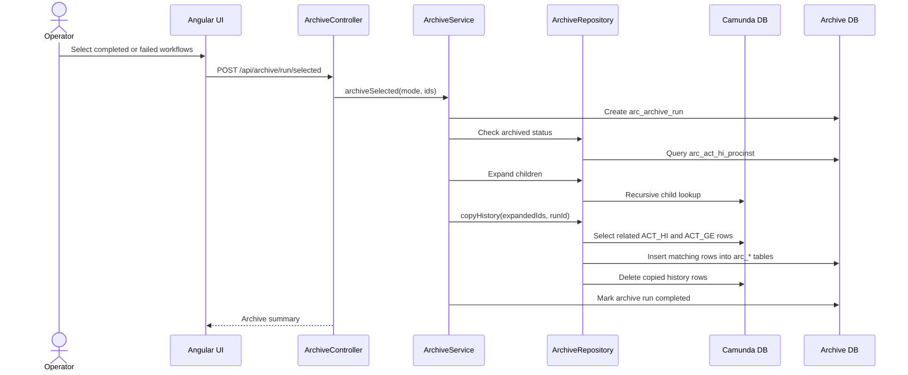

Figure 12: Manual archive sequence.

### Automatic Archive

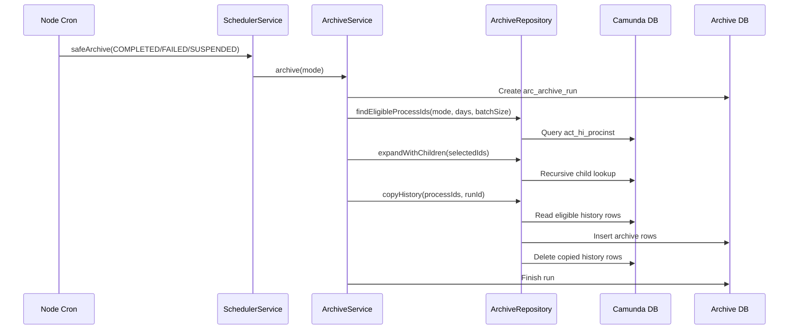

Figure 13: Automatic archive sequence.

### Restore Process

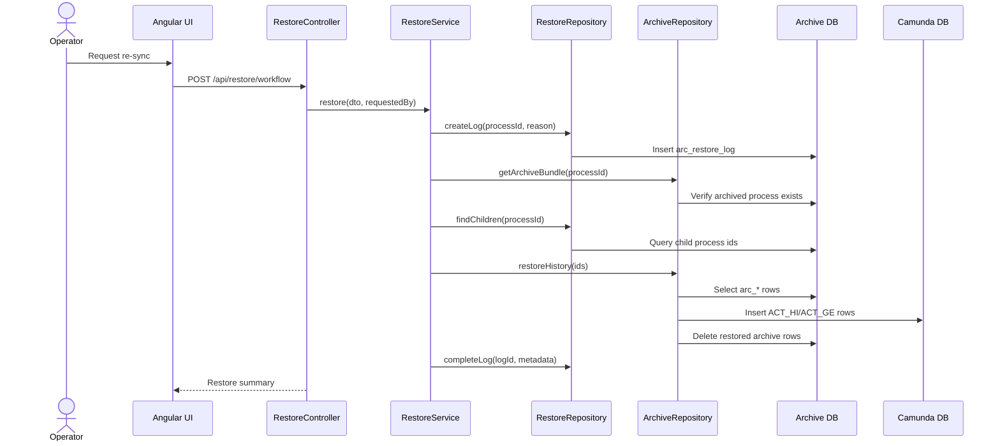

Figure 14: Restore sequence.

### History Cleanup Integration

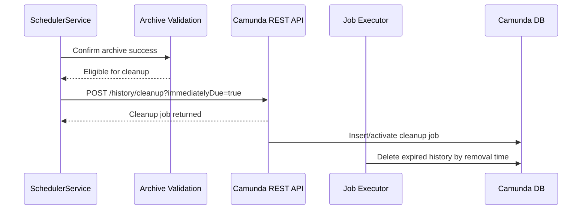

Figure 15: Optional History Cleanup integration sequence.

## 14. Advantages of the Current Design

The current implementation is effective because it is direct, auditable, and narrowly scoped.

- Performance improvement: old history rows are removed from primary Camunda history tables, reducing query and index volume.
- Database optimization: archive storage is separated from operational Camunda storage.
- Data integrity: copy-before-delete, transactional movement, and destination-column matching reduce risk during schema drift.
- Recovery capability: restore/re-sync can move archived history back to Camunda with original process instance ids.
- Operational simplicity: the UI and API expose explicit archive, restore, search, preview, and scheduler workflows.
- Fault tolerance: scheduler jobs process items independently and preserve retry history.
- Runtime safety: the design avoids `ACT_RU_*` writes and does not attempt to reconstruct active executions.
- Extensibility: new history tables can be added by extending archive schema and table mappings.

## 15. Limitations

Known limitations of the current implementation:

- Restore is history-only. It does not resume or recreate active runtime process executions.
- Direct delete-after-copy is the active archive deletion method; Camunda History Cleanup integration is currently documented as an optional/placeholder path.
- Cross-database transaction atomicity depends on two independent PostgreSQL clients, not a distributed transaction coordinator.
- Custom Camunda history tables require matching archive tables and mapping additions.
- If Camunda upgrades add new columns, archive schema migrations should be kept current, although the code dynamically ignores unknown destination columns.
- `ACT_GE_BYTEARRAY` inclusion is based on known reference fields; estate-specific binary references should be reviewed.
- Camunda History Cleanup does not provide a complete audit of deleted row ids, so archive logs remain the source of project-level audit.
- The local demo authentication provider must be replaced before production.

## 16. Future Enhancements

Future enhancements should be kept separate from the current implementation analysis.

Potential improvements:

- Complete the Camunda History Cleanup integration by making archived instances cleanup-eligible and invoking Camunda cleanup APIs after validation.
- Add a post-cleanup verification step that checks selected process ids are no longer present in Camunda history.
- Add deeper archive consistency validation that compares per-table counts before and after archive.
- Add production-grade migration tooling for archive schema evolution.
- Add enterprise identity integration such as SSO/OIDC.
- Add monthly or quarterly archive partitions and automated partition maintenance.
- Add configurable archive policies by process definition key, tenant, business domain, and regulatory retention class.
- Add stronger restore preflight checks for target-table conflicts and byte-array dependencies.
- Add dashboards for archive throughput, restore throughput, failed items, and cleanup job status.
- Add optional Camunda BPMN orchestration for archive and restore if workflow-level orchestration is required by operations governance.

## 17. References

- [Architecture](ARCHITECTURE.md)
- [API Overview](API.md)
- [Operations](OPERATIONS.md)
- [Restore Design](RESTORE_DESIGN.md)
- [Camunda Database Reference](camunda-database-docs.md)
- [Camunda History Cleanup](camunda-history-cleanup.md)
- [Archive schema](../infra/db/001_archive_schema.sql)
- [Archive service](../apps/api/src/modules/archive/archive.service.ts)
- [Archive repository](../apps/api/src/modules/archive/archive.repository.ts)
- [Restore service](../apps/api/src/modules/restore/restore.service.ts)
- [Scheduler service](../apps/api/src/modules/scheduler/scheduler.service.ts)
