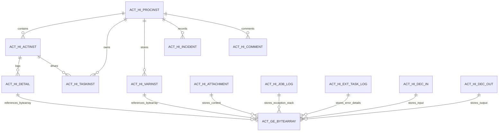

# Camunda Archive Session 6 – History Tables, Byte Array Dependencies, and Manual Archive Plan

## 1. Objective

This document covers the core implementation questions from the Session 6 analysis for a Camunda 7 archival design:

- Identify all Camunda history tables that are candidates for archival.
- Capture table relationships and foreign-key style dependencies.
- Document byte-array handling for `ACT_GE_BYTEARRAY` and `BYTEARRAY_ID_` references.
- Define a manual archive workflow and data validation flow.
- Prepare a safe archive/delete sequence that prevents destructive actions before validation passes.

---

## 2. History tables relevant to archiving

The relevant archival tables are the `ACT_HI_*` history tables. These are the main tables that store completed process, task, variable, job, and case information after runtime data has moved beyond the active lifecycle.

| History table | Purpose | Key dependency / special handling |
| --- | --- | --- |
| `ACT_HI_PROCINST` | Completed process instances | Linked to `ACT_RU_EXECUTION`, `ACT_RE_PROCDEF`, `ACT_HI_ACTINST` |
| `ACT_HI_ACTINST` | Activity execution history | Contains process and activity lifecycle history |
| `ACT_HI_TASKINST` | Task history | Linked to `ACT_RU_TASK` and `ACT_HI_ACTINST` |
| `ACT_HI_VARINST` | Latest variable state history | Often references `ACT_GE_BYTEARRAY` via `BYTEARRAY_ID_` |
| `ACT_HI_DETAIL` | Variable update audit trail | Full variable change log; byte-array sensitive |
| `ACT_HI_JOB_LOG` | Job execution history | Stores retries and exception stack references |
| `ACT_HI_EXT_TASK_LOG` | External task execution history | May store `ERROR_DETAILS_ID_` references |
| `ACT_HI_INCIDENT` | Incident lifecycle history | Source is runtime incident data |
| `ACT_HI_IDENTITYLINK` | User/group assignment history | Links to runtime identity link data |
| `ACT_HI_BATCH` | Batch history | Records batch lifecycle details |
| `ACT_HI_OP_LOG` | Operation log | Audit trail for administrative changes |
| `ACT_HI_COMMENT` | Process/task comments | May use process or task IDs |
| `ACT_HI_ATTACHMENT` | Attachment metadata | Usually references `ACT_GE_BYTEARRAY` content |
| `ACT_HI_DECINST` | Decision instance history | Decision execution lifecycle |
| `ACT_HI_DEC_IN` | Decision input history | Value payloads may be large |
| `ACT_HI_DEC_OUT` | Decision output history | Value payloads may be large |
| `ACT_HI_CASEINST` | Case instance history | CMMN case lifecycle |
| `ACT_HI_CASEACTINST` | Case activity history | CMMN activity lifecycle |
| `ACT_HI_CASETASKINST` | Case task history | CMMN task history |

> `ACT_GE_BYTEARRAY` is not a history table, but it is a critical dependency because many history rows may point to binary payloads such as variable values, stack traces, attachments, and decision payloads.

---

## 3. History tables and byte-array dependency map

### 3.1 Byte-array dependency summary

| History table | Byte-array dependency | Notes |
| --- | --- | --- |
| `ACT_HI_VARINST` | `BYTEARRAY_ID_` | Variable values may be stored as physical bytes |
| `ACT_HI_DETAIL` | `BYTEARRAY_ID_` | Variable update records can retain binary payloads |
| `ACT_HI_JOB_LOG` | `JOB_EXCEPTION_STACK_ID_` | Stack trace may be stored in `ACT_GE_BYTEARRAY` |
| `ACT_HI_EXT_TASK_LOG` | `ERROR_DETAILS_ID_` | Error payloads may be stored as binary |
| `ACT_HI_ATTACHMENT` | `CONTENT_ID_` | File content or attachments are stored in byte-array table |
| `ACT_HI_DEC_IN` | `BYTEARRAY_ID_` | Decision inputs can include large payloads |
| `ACT_HI_DEC_OUT` | `BYTEARRAY_ID_` | Decision outputs may be binary or serialized |

### 3.2 Key relationship model



This diagram shows the most important dependency pattern: the history tables are linked to each other by process, task, activity, and execution IDs, while byte-array storage sits underneath as the shared binary payload store for large or serialized values.

---

## 4. Table relationships and dependencies

The archive logic must respect the relationship chain rather than treat every table as independent.

### 4.1 Core process lineage

- `ACT_HI_PROCINST` is the root for a completed process instance.
- `ACT_HI_ACTINST` records each activity inside that process instance.
- `ACT_HI_TASKINST` records tasks related to activities or user tasks.
- `ACT_HI_VARINST` and `ACT_HI_DETAIL` represent variable data belonging to execution or activity scope.
- `ACT_HI_INCIDENT`, `ACT_HI_BATCH`, and `ACT_HI_JOB_LOG` are side-lifecycle records associated to the same process or execution chain.

### 4.2 Dependency rules

| Parent / source | Related history table | Relationship key |
| --- | --- | --- |
| Process instance | `ACT_HI_ACTINST` | `PROC_INST_ID_` |
| Process instance | `ACT_HI_TASKINST` | `PROC_INST_ID_` |
| Process instance | `ACT_HI_VARINST` | `PROC_INST_ID_` |
| Process instance | `ACT_HI_INCIDENT` | `PROC_INST_ID_` |
| Activity instance | `ACT_HI_DETAIL` | `ACT_INST_ID_` |
| Task instance | `ACT_HI_COMMENT` | `TASK_ID_` or `PROC_INST_ID_` |
| Job execution | `ACT_HI_JOB_LOG` | `JOB_ID_` |
| External task | `ACT_HI_EXT_TASK_LOG` | `EXECUTION_ID_` or related task record |
| Decision execution | `ACT_HI_DEC_IN` / `ACT_HI_DEC_OUT` | `DEC_INST_ID_` |

### 4.3 Critical validation rule

Archive must be performed in dependency order, not in arbitrary table order. A safe sequence is:

1. Identify process instance or task window.
2. Validate related history rows in parent tables first.
3. Retrieve associated byte-array records from `ACT_GE_BYTEARRAY`.
4. Archive child rows and binary payloads.
5. Validate row counts and references.
6. Only after validation passes, delete source records.

---

## 5. Manual archive approach plan

### 5.1 Step-by-step manual flow

1. Filter by date range
   - Use `START_TIME_`, `END_TIME_`, `CREATE_TIME_`, or `TIME_` depending on the table.
   - Limit the archive candidate set to completed or closed records.

2. Select only completed process/task scope
   - Include only `ACT_HI_PROCINST` rows matching completed states.
   - Exclude any active, running, suspended, or failed process records unless the design explicitly includes them.

3. Detect related records before archiving
   - Gather all `ACT_HI_ACTINST`, `ACT_HI_TASKINST`, `ACT_HI_VARINST`, `ACT_HI_DETAIL`, `ACT_HI_JOB_LOG`, and `ACT_HI_INCIDENT` rows tied to the selected process IDs.
   - Check for open incidents, failed jobs, running tasks, or runtime references that should block the archive.

4. Resolve `ACT_GE_BYTEARRAY` references
   - Locate every `BYTEARRAY_ID_`, `CONTENT_ID_`, `JOB_EXCEPTION_STACK_ID_`, `ERROR_DETAILS_ID_`, and related data element.
   - Check whether the byte array is shared across multiple rows before deleting it.
   - Store a complete archive payload for the binary data before removal.

5. Archive to the external store
   - Write rows to archive tables or an external storage data set.
   - Preserve original IDs and timestamps to allow re-sync or restore.
   - Keep a batch ID and archive timestamp for every chunk.

6. Validate results
   - Compare source row counts against archive row counts.
   - Validate key constraints and foreign-key references.
   - Confirm byte-array payloads were archived completely.
   - Confirm no partial records remain in the archive or source store.

7. Delete only after successful validation
   - Delete from source history tables only when archive validation passes.
   - If any batch or validation fails, stop and keep source data unchanged.

8. Store audit logs
   - Log batch ID, date range, filters, process IDs, task IDs, table names, counts, status, errors, timestamps, and archive result.

---

## 6. Source-to-target mapping guidance

| Source table | Archive target | Notes |
| --- | --- | --- |
| `ACT_HI_PROCINST` | Archive process history table | Root record for each process instance |
| `ACT_HI_ACTINST` | Archive activity history table | Child records under process instance |
| `ACT_HI_TASKINST` | Archive task history table | User task lifecycle details |
| `ACT_HI_VARINST` | Archive variable history table | Latest version of variable state |
| `ACT_HI_DETAIL` | Archive variable detail history table | Full update trail |
| `ACT_HI_JOB_LOG` | Archive job history table | Execution events and exceptions |
| `ACT_HI_EXT_TASK_LOG` | Archive external-task history table | Worker retries and errors |
| `ACT_HI_INCIDENT` | Archive incident history table | Resolved or closed incidents |
| `ACT_HI_IDENTITYLINK` | Archive identity-link history table | Assignment history |
| `ACT_HI_BATCH` | Archive batch history table | Batch lifecycle records |
| `ACT_HI_ATTACHMENT` | Archive attachment payload table | Includes binary content |
| `ACT_HI_COMMENT` | Archive comment history table | Optional human-readable data |
| `ACT_HI_DECINST` / `ACT_HI_DEC_IN` / `ACT_HI_DEC_OUT` | Archive decision history tables | Decision execution evidence |
| `ACT_GE_BYTEARRAY` | Archive binary payload store | Must be moved with dependency checks |

---

## 7. Safety checks before deletion

The deletion phase should only proceed if all of the following conditions pass:

- All selected records are successfully archived.
- All referenced byte-array entries are accounted for.
- No active runtime process still references the archived IDs.
- No failed jobs or incidents are still unresolved for the selected batch.
- Row counts match between source and archive for each table.
- The sequence is reversible in the event of rollback requirements.

If any check fails, the archive job must be marked as failed and the delete operation must not proceed.

---

## 8. Validation and rollback rules

### 8.1 Validation checklist

- Compare record counts by date range and process ID.
- Validate all `PROC_INST_ID_`, `TASK_ID_`, `ACT_INST_ID_`, and `DEC_INST_ID_` links.
- Check that all byte-array references are present in the archive store.
- Confirm no orphan rows exist in the archive set.
- Confirm source records are still intact if an archive step fails.

### 8.2 Rollback guidance

- Rollback should be possible batch-by-batch, not just across the entire dataset.
- If one table in the dependency chain fails, no additional delete should occur for that batch.
- Keep a recovery copy of archive payloads and metadata until validation is complete.

---

## 9. Archive log requirements

Every archive batch should produce a complete audit record containing:

- Batch ID
- Archive date and time
- Date-range filter
- Process and task filters
- Source and target table names
- Row counts per table
- Archive status (success, partial, failed)
- Byte-array references and count
- Validation result
- Error details and retry count
- Operator or system user
- Final deletion status

---

## 10. Manual archive execution sequence

```text
Filter by date range
    -> Select completed process/task window
    -> Validate no active runtime dependencies remain
    -> Identify related ACT_HI_* rows
    -> Resolve ACT_GE_BYTEARRAY references
    -> Archive all dependent records
    -> Validate source vs archive counts
    -> Validate byte-array payload integrity
    -> Delete source rows only after success
    -> Store archive audit log
```

---

## 11. Conclusion

The architectural direction is clear: archive the completed history data in a dependency-aware sequence, pay special attention to the shared binary payloads stored in `ACT_GE_BYTEARRAY`, and never delete source records before validation has proven the archive is complete and consistent.

This gives the project a safe manual process that can later be automated with scheduler, batch, or workflow-driven orchestration.
