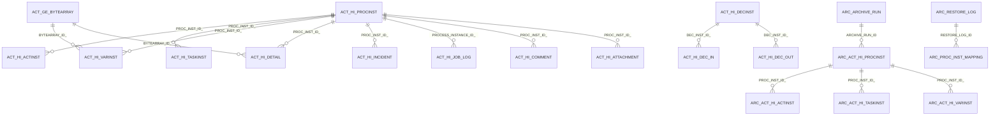

# Camunda Database Reference for the Archive Project

This document describes the Camunda 7 database areas relevant to the archive and restore implementation. It is intentionally focused on the data that the project reads, archives, deletes, and re-syncs.

## 1. Database Areas

| Prefix | Category | Archive Project Usage |
| --- | --- | --- |
| `ACT_RE_*` | Repository | Process, decision, form, and deployment metadata. Read indirectly through Camunda APIs. Not archived by this project. |
| `ACT_RU_*` | Runtime | Active process execution state. The project does not archive, delete, or restore runtime rows. |
| `ACT_HI_*` | History | Primary archive scope. Completed, failed, and historic workflow data is copied to `arc_*` tables. |
| `ACT_GE_*` | General | `ACT_GE_BYTEARRAY` is archived when referenced by selected history rows. Engine properties and schema logs are not archived. |
| `ACT_ID_*` | Identity | Users, groups, memberships, and tenant metadata. Not archived. Historic identity links are archived through `ACT_HI_IDENTITYLINK`. |

## 2. Runtime-to-History Mapping

Camunda runtime tables hold active execution state. When execution events occur, Camunda writes history rows according to the configured history level.

| Runtime Table | History Table or Tables | Notes |
| --- | --- | --- |
| `ACT_RU_EXECUTION` | `ACT_HI_PROCINST`, `ACT_HI_ACTINST` | Process instance and activity lifecycle. |
| `ACT_RU_TASK` | `ACT_HI_TASKINST` | User task history. |
| `ACT_RU_VARIABLE` | `ACT_HI_VARINST`, `ACT_HI_DETAIL` | Latest values and detailed updates. |
| `ACT_RU_INCIDENT` | `ACT_HI_INCIDENT` | Incident history. |
| `ACT_RU_JOB` | `ACT_HI_JOB_LOG` | Job execution log only, not active job state. |
| `ACT_RU_EXTERNAL_TASK` | `ACT_HI_EXT_TASK_LOG` | External task log only, not active lock state. |
| `ACT_RU_BATCH` | `ACT_HI_BATCH` | Batch history. |
| `ACT_RU_IDENTITYLINK` | `ACT_HI_IDENTITYLINK` | Historic user/group links. |

The archive project uses historic data only. It intentionally does not reconstruct runtime execution trees, timers, active jobs, locks, event subscriptions, or open tasks.

## 3. Implemented Archive Table Mapping

The archive schema mirrors selected Camunda history and binary tables with an `arc_` prefix.

| Camunda Source | Archive Target | Selection Rule |
| --- | --- | --- |
| `act_hi_procinst` | `arc_act_hi_procinst` | `proc_inst_id_ = any($1)` |
| `act_hi_actinst` | `arc_act_hi_actinst` | `proc_inst_id_ = any($1)` |
| `act_hi_taskinst` | `arc_act_hi_taskinst` | `proc_inst_id_ = any($1)` |
| `act_hi_varinst` | `arc_act_hi_varinst` | `proc_inst_id_ = any($1)` |
| `act_hi_detail` | `arc_act_hi_detail` | `proc_inst_id_ = any($1)` |
| `act_hi_identitylink` | `arc_act_hi_identitylink` | Process, root, or task relationship depending on available columns. |
| `act_hi_decinst` | `arc_act_hi_decinst` | Process relationship. |
| `act_hi_dec_in` | `arc_act_hi_dec_in` | `dec_inst_id_` from selected decision instances. |
| `act_hi_dec_out` | `arc_act_hi_dec_out` | `dec_inst_id_` from selected decision instances. |
| `act_hi_batch` | `arc_act_hi_batch` | Batch ids referenced by selected operation logs. |
| `act_hi_incident` | `arc_act_hi_incident` | Process relationship. |
| `act_hi_job_log` | `arc_act_hi_job_log` | `process_instance_id_ = any($1)` |
| `act_hi_ext_task_log` | `arc_act_hi_ext_task_log` | Process relationship. |
| `act_hi_caseinst` | `arc_act_hi_caseinst` | Case ids referenced by selected process history. |
| `act_hi_caseactinst` | `arc_act_hi_caseactinst` | Case ids referenced by selected process history. |
| `act_hi_casetaskinst` | `arc_act_hi_casetaskinst` | Case ids referenced by selected process history. |
| `act_ge_bytearray` | `arc_act_ge_bytearray` | Referenced byte-array ids from variables, details, jobs, decisions, external tasks, and attachments. |
| `act_hi_op_log` | `arc_act_hi_op_log` | Process, root, execution, task, job, or batch relationship depending on available columns. |
| `act_hi_attachment` | `arc_act_hi_attachment` | Process or task relationship. |
| `act_hi_comment` | `arc_act_hi_comment` | Process or task relationship. |

Archive tables include additional metadata columns:

| Column | Purpose |
| --- | --- |
| `archived_at` | Timestamp when the row was copied into the archive table. |
| `archive_run_id` | Link to `arc_archive_run`. |
| `soft_deleted_at` | Reserved soft-delete marker for archive-side lifecycle management. |

## 4. Key History Tables

### `ACT_HI_PROCINST`

Stores one historic process instance row. This is the main root table for archive selection and search.

Important fields:

- `PROC_INST_ID_`
- `BUSINESS_KEY_`
- `PROC_DEF_KEY_`
- `PROC_DEF_ID_`
- `START_TIME_`
- `END_TIME_`
- `DURATION_`
- `DELETE_REASON_`
- `STATE_`
- `REMOVAL_TIME_`
- `SUPER_PROCESS_INSTANCE_ID_`
- `ROOT_PROC_INST_ID_`
- `TENANT_ID_`

Archive use:

- Completed mode selects rows where `END_TIME_ is not null` and `DELETE_REASON_ is null`.
- Failed mode selects rows where `END_TIME_ is not null` and `DELETE_REASON_ is not null`.
- Suspended mode selects rows where `STATE_ = 'SUSPENDED'` and `END_TIME_ is null`.
- Child process instances are discovered through `SUPER_PROCESS_INSTANCE_ID_`.

### `ACT_HI_ACTINST`

Stores activity execution history for service tasks, user tasks, gateways, events, and call activities.

Archive use:

- Copied for selected `PROC_INST_ID_` values.
- Preserves BPMN timeline and call activity references.

### `ACT_HI_TASKINST`

Stores historic user task instances.

Archive use:

- Copied for selected `PROC_INST_ID_` values.
- Completed archive mode verifies there are no unfinished task history rows for the selected workflow tree.

### `ACT_HI_VARINST`

Stores current historic variable values.

Archive use:

- Copied for selected `PROC_INST_ID_` values.
- `BYTEARRAY_ID_` references are used to include serialized values from `ACT_GE_BYTEARRAY`.

### `ACT_HI_DETAIL`

Stores fine-grained variable updates, form properties, and detailed history events.

Archive use:

- Copied for selected `PROC_INST_ID_` values.
- `BYTEARRAY_ID_` references are included in binary archive selection.

### `ACT_HI_INCIDENT`

Stores incident history.

Archive use:

- Preserves failure analysis information for failed or problematic workflows.

### `ACT_HI_JOB_LOG`

Stores historic job execution events.

Archive use:

- Selected by `PROCESS_INSTANCE_ID_`.
- `JOB_EXCEPTION_STACK_ID_` references are included in byte-array archive selection.

### `ACT_HI_EXT_TASK_LOG`

Stores external task lifecycle log entries.

Archive use:

- Preserves external worker execution audit.
- `ERROR_DETAILS_ID_` references are included in byte-array archive selection.

### `ACT_HI_DECINST`, `ACT_HI_DEC_IN`, and `ACT_HI_DEC_OUT`

Store decision instance, decision input, and decision output history.

Archive use:

- Decision instances are copied by process relationship.
- Inputs and outputs are copied by `DEC_INST_ID_`.
- Byte-array backed decision values are included.

### `ACT_GE_BYTEARRAY`

Stores binary values used by serialized variables, exception stacks, attachments, deployment resources, and other engine payloads.

Archive use:

- The project copies only byte arrays referenced by selected history records.
- Repository deployment resources are not broadly archived unless referenced by selected history rows.

## 5. Tables Not Reconstructed by Restore

The restore process does not rebuild active runtime state or repository metadata. The following categories are out of scope:

| Category | Examples | Reason |
| --- | --- | --- |
| Runtime execution | `ACT_RU_EXECUTION`, `ACT_RU_TASK`, `ACT_RU_VARIABLE` | Restore is history re-sync only. |
| Runtime jobs and timers | `ACT_RU_JOB`, `ACT_RU_TIMER_JOB`, `ACT_RU_DEADLETTER_JOB` | Active scheduling state cannot be safely recreated from history. |
| Runtime subscriptions | `ACT_RU_EVENT_SUBSCR` | Event subscriptions belong to active execution state. |
| Repository definitions | `ACT_RE_PROCDEF`, `ACT_RE_DEPLOYMENT`, `ACT_RE_DECISION_DEF` | Process definitions remain managed by Camunda deployments. |
| Identity data | `ACT_ID_USER`, `ACT_ID_GROUP`, `ACT_ID_MEMBERSHIP`, `ACT_ID_TENANT` | Identity is enterprise master data, not workflow history. |
| Engine metadata | `ACT_GE_PROPERTY`, `ACT_GE_SCHEMA_LOG` | Engine configuration and schema state are not archived as workflow history. |

## 6. Archive and Restore Database Rules

The implementation follows these rules:

1. Active runtime workflows are not archived.
2. `ACT_RU_*` tables are not modified.
3. Parent and child process histories can be archived together.
4. Source rows are copied before they are deleted.
5. Restore copies rows back before deleting archive rows.
6. Insert operations use columns that exist in the destination table.
7. Archive metadata columns are never copied back into Camunda tables.
8. Duplicate inserts are ignored with `on conflict do nothing`.
9. Archive and restore operations are logged in archive metadata tables.

## 7. Logical ERD

## 8. Source Files

- Archive schema: `infra/db/001_archive_schema.sql`
- Archive repository: `apps/api/src/modules/archive/archive.repository.ts`
- Archive service: `apps/api/src/modules/archive/archive.service.ts`
- Restore service: `apps/api/src/modules/restore/restore.service.ts`
- Scheduler service: `apps/api/src/modules/scheduler/scheduler.service.ts`
