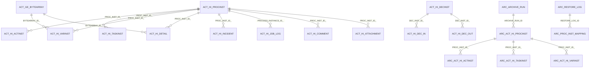

# Camunda Database Reference for the Archive Project

This document describes the Camunda 7 database areas relevant to the archive and restore implementation. It is intentionally focused on the data that the project reads, archives, deletes, and re-syncs.

| Runtime / Source Table  | History Table Exists     | History Table(s)                      | Runtime Event                          | History Record Created | Updated After Completion       | Runtime Columns Used                                                             | History Columns Populated / Updated                                                                                     | Data Stored                                                                         |
| ----------------------- | ------------------------ | ------------------------------------- | -------------------------------------- | ---------------------- | ------------------------------ | -------------------------------------------------------------------------------- | ----------------------------------------------------------------------------------------------------------------------- | ----------------------------------------------------------------------------------- |
| ACT_RE_DEPLOYMENT       | No                       | —                                     | Deployment                             | Never                  | No                             | `ID_`, `NAME_`, `DEPLOY_TIME_`, `SOURCE_`                                        | —                                                                                                                       | Deployment metadata                                                                 |
| ACT_RE_PROCDEF          | No                       | —                                     | Process deployment                     | Never                  | No                             | `ID_`, `KEY_`, `VERSION_`, `RESOURCE_NAME_`                                      | —                                                                                                                       | BPMN process definition metadata                                                    |
| ACT_RE_CASE_DEF         | No                       | —                                     | Case deployment                        | Never                  | No                             | `ID_`, `KEY_`, `VERSION_`                                                        | —                                                                                                                       | CMMN definition metadata                                                            |
| ACT_RE_DECISION_DEF     | No                       | —                                     | DMN deployment                         | Never                  | No                             | `ID_`, `KEY_`, `VERSION_`                                                        | —                                                                                                                       | Decision definition metadata                                                        |
| ACT_RE_DECISION_REQ_DEF | No                       | —                                     | DRD deployment                         | Never                  | No                             | `ID_`, `KEY_`, `VERSION_`                                                        | —                                                                                                                       | Decision requirements metadata                                                      |
| ACT_GE_PROPERTY         | No                       | —                                     | Engine startup/update                  | Never                  | No                             | `NAME_`, `VALUE_`                                                                | —                                                                                                                       | Engine properties                                                                   |
| ACT_GE_SCHEMA_LOG       | No                       | —                                     | Schema upgrade                         | Never                  | No                             | `VERSION_`, `TIMESTAMP_`                                                         | —                                                                                                                       | Database schema history                                                             |
| ACT_GE_BYTEARRAY        | Shared Storage           | Referenced by multiple history tables | Binary object created                  | Immediately            | Updated only if binary changes | `ID_`, `NAME_`, `BYTES_`, `DEPLOYMENT_ID_`                                       | Referenced by `BYTEARRAY_ID_`, `CONTENT_ID_`, `JOB_EXCEPTION_STACK_ID_`, `ERROR_DETAILS_ID_`                            | BPMN XML, DMN XML, CMMN XML, serialized variables, files, attachments, stack traces |
| ACT_RU_EXECUTION        | Yes                      | ACT_HI_PROCINST, ACT_HI_ACTINST       | Process/activity starts                | Immediately            | Yes                            | `ID_`, `PROC_INST_ID_`, `PROC_DEF_ID_`, `BUSINESS_KEY_`, `ACT_ID_`, `PARENT_ID_` | `PROC_INST_ID_`, `PROC_DEF_ID_`, `START_TIME_`, `END_TIME_`, `STATE_`, `DURATION_`, `ACT_ID_`, `ACT_NAME_`, `ACT_TYPE_` | Running process execution                                                           |
| ACT_RU_TASK             | Yes                      | ACT_HI_TASKINST                       | User task created                      | Immediately            | Yes                            | `ID_`, `NAME_`, `ASSIGNEE_`, `OWNER_`, `PRIORITY_`, `CREATE_TIME_`, `DUE_DATE_`  | `TASK_ID_`, `NAME_`, `ASSIGNEE_`, `OWNER_`, `START_TIME_`, `END_TIME_`, `DELETE_REASON_`, `DURATION_`                   | Active user tasks                                                                   |
| ACT_RU_VARIABLE         | Yes                      | ACT_HI_VARINST, ACT_HI_DETAIL         | Variable created/updated               | Immediately            | Latest value updated           | `NAME_`, `TYPE_`, `TEXT_`, `LONG_`, `DOUBLE_`, `BYTEARRAY_ID_`                   | `NAME_`, `VAR_TYPE_`, `TEXT_`, `LONG_`, `DOUBLE_`, `BYTEARRAY_ID_`, `TIME_`, `SEQUENCE_COUNTER_`                        | Runtime variables                                                                   |
| ACT_RU_JOB              | Partial                  | ACT_HI_JOB_LOG                        | Async job created/executed             | Every job event        | No                             | `ID_`, `RETRIES_`, `DUEDATE_`, `EXCEPTION_STACK_ID_`                             | `JOB_ID_`, `JOB_STATE_`, `TIMESTAMP_`, `RETRIES_`, `EXCEPTION_MSG_`, `JOB_EXCEPTION_STACK_ID_`                          | Async job execution                                                                 |
| ACT_RU_TIMER_JOB        | Partial                  | ACT_HI_JOB_LOG                        | Timer created/fired                    | Every timer event      | No                             | `ID_`, `DUEDATE_`, `RETRIES_`                                                    | Same as Job Log                                                                                                         | Timer jobs                                                                          |
| ACT_RU_SUSPENDED_JOB    | Partial                  | ACT_HI_JOB_LOG                        | Job suspended                          | Every suspend/resume   | No                             | `ID_`, `RETRIES_`                                                                | Job state information                                                                                                   | Suspended jobs                                                                      |
| ACT_RU_DEADLETTER_JOB   | Partial                  | ACT_HI_JOB_LOG                        | Job moved to dead letter               | Failure event          | No                             | `ID_`, `EXCEPTION_STACK_ID_`, `RETRIES_`                                         | Exception details, retries                                                                                              | Failed jobs                                                                         |
| ACT_RU_EXTERNAL_TASK    | Yes                      | ACT_HI_EXT_TASK_LOG                   | External task created/completed/failed | Every event            | No                             | `TOPIC_NAME_`, `WORKER_ID_`, `RETRIES_`, `ERROR_DETAILS_ID_`                     | `TOPIC_NAME_`, `WORKER_ID_`, `TIMESTAMP_`, `ERROR_MSG_`, `RETRIES_`                                                     | External task execution                                                             |
| ACT_RU_INCIDENT         | Yes                      | ACT_HI_INCIDENT                       | Incident created                       | Immediately            | Yes                            | `INCIDENT_TYPE_`, `INCIDENT_MSG_`, `FAILED_ACTIVITY_ID_`                         | `INCIDENT_MSG_`, `ACTIVITY_ID_`, `CREATE_TIME_`, `END_TIME_`                                                            | Runtime incidents                                                                   |
| ACT_RU_EVENT_SUBSCR     | No                       | —                                     | Event subscription created             | Never                  | No                             | `EVENT_TYPE_`, `EVENT_NAME_`, `EXECUTION_ID_`                                    | —                                                                                                                       | Runtime event subscriptions                                                         |
| ACT_RU_IDENTITYLINK     | Partial *(FULL history)* | ACT_HI_IDENTITYLINK                   | Candidate/assignee added or removed    | Immediately            | No                             | `USER_ID_`, `GROUP_ID_`, `TYPE_`, `TASK_ID_`                                     | `USER_ID_`, `GROUP_ID_`, `TYPE_`, `TIME_`                                                                               | User/group assignment                                                               |
| ACT_RU_AUTHORIZATION    | No                       | —                                     | Authorization created                  | Never                  | No                             | `USER_ID_`, `GROUP_ID_`, `RESOURCE_ID_`                                          | —                                                                                                                       | Authorization rules                                                                 |
| ACT_RU_FILTER           | No                       | —                                     | Filter created                         | Never                  | No                             | `NAME_`, `QUERY_`                                                                | —                                                                                                                       | Saved task filters                                                                  |
| ACT_RU_METER_LOG        | No                       | —                                     | Metric generated                       | Never                  | No                             | `NAME_`, `VALUE_`, `TIMESTAMP_`                                                  | —                                                                                                                       | Engine metrics                                                                      |
| ACT_RU_BATCH            | Yes                      | ACT_HI_BATCH                          | Batch started                          | Immediately            | Yes                            | `TYPE_`, `TOTAL_JOBS_`, `SEED_JOB_DEF_ID_`                                       | `TYPE_`, `START_TIME_`, `END_TIME_`, `TOTAL_JOBS_`                                                                      | Batch processing                                                                    |
| ACT_ID_USER             | No                       | —                                     | User created/updated                   | Never                  | No                             | `ID_`, `FIRST_`, `LAST_`, `EMAIL_`                                               | —                                                                                                                       | User information                                                                    |
| ACT_ID_GROUP            | No                       | —                                     | Group created                          | Never                  | No                             | `ID_`, `NAME_`, `TYPE_`                                                          | —                                                                                                                       | Group information                                                                   |
| ACT_ID_MEMBERSHIP       | No                       | —                                     | User added to group                    | Never                  | No                             | `USER_ID_`, `GROUP_ID_`                                                          | —                                                                                                                       | User-group mapping                                                                  |
| ACT_ID_TENANT           | No                       | —                                     | Tenant created                         | Never                  | No                             | `ID_`, `NAME_`                                                                   | —                                                                                                                       | Tenant information                                                                  |
| ACT_ID_TENANT_MEMBER    | No                       | —                                     | Tenant member added                    | Never                  | No                             | `TENANT_ID_`, `USER_ID_`, `GROUP_ID_`                                            | —                                                                                                                       | Tenant membership                                                                   |
| ACT_HI_PROCINST         | Already History          | Self                                  | Process starts                         | Yes                    | Yes                            | —                                                                                | `START_TIME_`, `END_TIME_`, `STATE_`, `DURATION_`, `DELETE_REASON_`                                                     | Process history                                                                     |
| ACT_HI_ACTINST          | Already History          | Self                                  | Activity starts                        | Yes                    | Yes                            | —                                                                                | `START_TIME_`, `END_TIME_`, `DURATION_`, `ACT_TYPE_`                                                                    | Activity history                                                                    |
| ACT_HI_TASKINST         | Already History          | Self                                  | Task created                           | Yes                    | Yes                            | —                                                                                | `ASSIGNEE_`, `OWNER_`, `END_TIME_`, `DELETE_REASON_`                                                                    | Task history                                                                        |
| ACT_HI_VARINST          | Already History          | Self                                  | Variable created                       | Yes                    | Yes                            | —                                                                                | Latest variable value                                                                                                   | Variable history                                                                    |
| ACT_HI_DETAIL           | Already History          | Self                                  | Variable updated                       | Every update           | No                             | —                                                                                | Variable update snapshot                                                                                                | Variable audit trail                                                                |
| ACT_HI_JOB_LOG          | Already History          | Self                                  | Job event                              | Every event            | No                             | —                                                                                | Job state, retries, exceptions                                                                                          | Job history                                                                         |
| ACT_HI_EXT_TASK_LOG     | Already History          | Self                                  | External task event                    | Every event            | No                             | —                                                                                | Worker, retries, errors                                                                                                 | External task history                                                               |
| ACT_HI_INCIDENT         | Already History          | Self                                  | Incident event                         | Yes                    | Yes                            | —                                                                                | Incident lifecycle                                                                                                      | Incident history                                                                    |
| ACT_HI_IDENTITYLINK     | Already History          | Self                                  | Identity link event                    | Yes                    | No                             | —                                                                                | User/group assignment history                                                                                           | Identity link history                                                               |
| ACT_HI_BATCH            | Already History          | Self                                  | Batch created                          | Yes                    | Yes                            | —                                                                                | Batch lifecycle                                                                                                         | Batch history                                                                       |
| ACT_HI_OP_LOG           | Already History          | Self                                  | User operation                         | Every operation        | No                             | —                                                                                | Operation type, entity, user                                                                                            | Audit log                                                                           |
| ACT_HI_COMMENT          | Already History          | Self                                  | Comment added                          | Yes                    | No                             | —                                                                                | Comment details                                                                                                         | Task/process comments                                                               |
| ACT_HI_ATTACHMENT       | Already History          | Self                                  | Attachment added                       | Yes                    | No                             | —                                                                                | Attachment metadata                                                                                                     | Attachments                                                                         |
| ACT_HI_DECINST          | Already History          | Self                                  | DMN executed                           | Yes                    | No                             | —                                                                                | Decision execution                                                                                                      | Decision history                                                                    |
| ACT_HI_DEC_IN           | Already History          | Self                                  | Decision executed                      | Yes                    | No                             | —                                                                                | Input values                                                                                                            | Decision input history                                                              |
| ACT_HI_DEC_OUT          | Already History          | Self                                  | Decision executed                      | Yes                    | No                             | —                                                                                | Output values                                                                                                           | Decision output history                                                             |
| ACT_HI_CASEINST         | Already History          | Self                                  | Case started                           | Yes                    | Yes                            | —                                                                                | Case lifecycle                                                                                                          | Case history                                                                        |
| ACT_HI_CASEACTINST      | Already History          | Self                                  | Case activity started                  | Yes                    | Yes                            | —                                                                                | Activity lifecycle                                                                                                      | Case activity history                                                               |


## History tables data

| Runtime Table            | History Table                                    | When Data is Written       | Runtime Columns Used                                                                                                                 | History Columns Populated                                                                                                     | What Data is Stored                             |
| ------------------------ | ------------------------------------------------ | -------------------------- | ------------------------------------------------------------------------------------------------------------------------------------ | ----------------------------------------------------------------------------------------------------------------------------- | ----------------------------------------------- |
| **ACT_RU_EXECUTION**     | **ACT_HI_PROCINST**                              | Process Instance Start     | `ID_`, `PROC_INST_ID_`, `PROC_DEF_ID_`, `BUSINESS_KEY_`, `START_TIME_`, `START_USER_ID_`, `SUPER_PROCESS_INSTANCE_ID_`, `TENANT_ID_` | `PROC_INST_ID_`, `PROC_DEF_ID_`, `BUSINESS_KEY_`, `START_TIME_`, `START_USER_ID_`, `SUPER_PROCESS_INSTANCE_ID_`, `TENANT_ID_` | Process instance history                        |
| ACT_RU_EXECUTION         | ACT_HI_PROCINST                                  | Process Completion         | —                                                                                                                                    | `END_TIME_`, `DURATION_`, `STATE_`, `DELETE_REASON_`                                                                          | Process completion information                  |
| ACT_RU_EXECUTION         | **ACT_HI_ACTINST**                               | Every Activity Start       | `ACT_ID_`, `ACT_INST_ID_`, `EXECUTION_ID_`, `PROC_DEF_ID_`                                                                           | `ACT_INST_ID_`, `ACT_ID_`, `ACT_NAME_`, `ACT_TYPE_`, `EXECUTION_ID_`, `PROC_DEF_ID_`, `START_TIME_`                           | Activity execution history                      |
| ACT_RU_EXECUTION         | ACT_HI_ACTINST                                   | Activity Completion        | —                                                                                                                                    | `END_TIME_`, `DURATION_`, `TASK_ID_`, `ASSIGNEE_`                                                                             | Activity completion history                     |
| **ACT_RU_VARIABLE**      | **ACT_HI_VARINST**                               | Variable Created           | `NAME_`, `TYPE_`, `TEXT_`, `TEXT2_`, `LONG_`, `DOUBLE_`, `BYTEARRAY_ID_`, `EXECUTION_ID_`, `TASK_ID_`                                | `NAME_`, `VAR_TYPE_`, `TEXT_`, `TEXT2_`, `LONG_`, `DOUBLE_`, `BYTEARRAY_ID_`, `CREATE_TIME_`                                  | Latest variable value                           |
| ACT_RU_VARIABLE          | ACT_HI_VARINST                                   | Variable Updated           | `TEXT_`, `LONG_`, `DOUBLE_`, `BYTEARRAY_ID_`                                                                                         | Same row updated with latest values                                                                                           | Latest variable state                           |
| ACT_RU_VARIABLE          | **ACT_HI_DETAIL**                                | Every Variable Create      | `NAME_`, `TYPE_`, `TEXT_`, `LONG_`, `DOUBLE_`, `BYTEARRAY_ID_`                                                                       | `TYPE_='VariableUpdate'`, `NAME_`, `TEXT_`, `LONG_`, `DOUBLE_`, `BYTEARRAY_ID_`, `TIME_`, `SEQUENCE_COUNTER_`                 | Variable audit record                           |
| ACT_RU_VARIABLE          | ACT_HI_DETAIL                                    | Every Variable Update      | Updated variable values                                                                                                              | New row inserted                                                                                                              | Complete variable change history (every update) |
| **ACT_RU_TASK**          | **ACT_HI_TASKINST**                              | Task Created               | `ID_`, `NAME_`, `ASSIGNEE_`, `OWNER_`, `PRIORITY_`, `CREATE_TIME_`, `DUE_DATE_`                                                      | `TASK_ID_`, `NAME_`, `ASSIGNEE_`, `OWNER_`, `CREATE_TIME_`, `PRIORITY_`, `DUE_DATE_`                                          | User task history                               |
| ACT_RU_TASK              | ACT_HI_TASKINST                                  | Task Completed             | —                                                                                                                                    | `END_TIME_`, `DURATION_`, `DELETE_REASON_`                                                                                    | Task completion history                         |
| **ACT_RU_JOB**           | **ACT_HI_JOB_LOG**                               | Job Created                | `ID_`, `RETRIES_`, `DUEDATE_`                                                                                                        | `JOB_ID_`, `JOB_STATE_`, `TIMESTAMP_`                                                                                         | Job creation log                                |
| ACT_RU_JOB               | ACT_HI_JOB_LOG                                   | Job Failed                 | `EXCEPTION_STACK_ID_`                                                                                                                | `EXCEPTION_MSG_`, `JOB_EXCEPTION_STACK_ID_`, `RETRIES_`                                                                       | Exception history                               |
| ACT_RU_JOB               | ACT_HI_JOB_LOG                                   | Job Success                | `RETRIES_`                                                                                                                           | `JOB_STATE_='SUCCESSFUL'`                                                                                                     | Successful execution log                        |
| **ACT_RU_EXTERNAL_TASK** | **ACT_HI_EXT_TASK_LOG**                          | External Task Created      | `TOPIC_NAME_`, `WORKER_ID_`, `PRIORITY_`                                                                                             | `TOPIC_NAME_`, `WORKER_ID_`, `TIMESTAMP_`                                                                                     | External task history                           |
| ACT_RU_EXTERNAL_TASK     | ACT_HI_EXT_TASK_LOG                              | External Task Failed       | `ERROR_DETAILS_ID_`, `RETRIES_`                                                                                                      | `ERROR_MSG_`, `ERROR_DETAILS_ID_`, `RETRIES_`                                                                                 | Failure details                                 |
| ACT_RU_EXTERNAL_TASK     | ACT_HI_EXT_TASK_LOG                              | External Task Completed    | —                                                                                                                                    | Completion event                                                                                                              | Completion log                                  |
| **ACT_RU_INCIDENT**      | **ACT_HI_INCIDENT**                              | Incident Created           | `INCIDENT_TYPE_`, `INCIDENT_MSG_`, `FAILED_ACTIVITY_ID_`                                                                             | `INCIDENT_TYPE_`, `INCIDENT_MSG_`, `ACTIVITY_ID_`, `CREATE_TIME_`                                                             | Incident history                                |
| ACT_RU_INCIDENT          | ACT_HI_INCIDENT                                  | Incident Resolved          | —                                                                                                                                    | `END_TIME_`                                                                                                                   | Resolution history                              |
| **ACT_RU_BATCH**         | **ACT_HI_BATCH**                                 | Batch Created              | `TYPE_`, `TOTAL_JOBS_`, `SEED_JOB_DEF_ID_`                                                                                           | `TYPE_`, `START_TIME_`, `TOTAL_JOBS_`                                                                                         | Batch execution history                         |
| ACT_RU_BATCH             | ACT_HI_BATCH                                     | Batch Completed            | —                                                                                                                                    | `END_TIME_`                                                                                                                   | Batch completion                                |
| **ACT_RU_IDENTITYLINK**  | **ACT_HI_IDENTITYLINK** *(History Level = FULL)* | Candidate User/Group Added | `USER_ID_`, `GROUP_ID_`, `TYPE_`, `TASK_ID_`                                                                                         | `USER_ID_`, `GROUP_ID_`, `TYPE_`, `TIME_`                                                                                     | Identity assignment history                     |


## History tables + `ACT_GE_BYTEARRAY` dependency mapping

| History Table | Depended Tables | Depended Columns with Tables |
| --- | --- | --- |
| `ACT_HI_PROCINST` | `ACT_RU_EXECUTION`, `ACT_HI_ACTINST`, `ACT_RE_PROCDEF` | `PROC_INST_ID_`, `PROC_DEF_ID_`, `ROOT_PROC_INST_ID_`, `BUSINESS_KEY_` from `ACT_RU_EXECUTION`; `END_ACT_ID_` from `ACT_HI_ACTINST` |
| `ACT_HI_ACTINST` | `ACT_RU_EXECUTION`, `ACT_RU_TASK`, `ACT_RE_PROCDEF`, `ACT_RU_CASE_EXECUTION` | `ID_`, `PARENT_ID_`, `PROC_DEF_ID_`, `PROC_INST_ID_`, `EXECUTION_ID_`, `ACT_ID_`, `ROOT_PROC_INST_ID_`, `TENANT_ID_` from `ACT_RU_EXECUTION`; `TASK_ID_` from `ACT_RU_TASK`; `PROC_DEF_KEY_`, `ACT_NAME_`, `ACT_TYPE_` from `ACT_RE_PROCDEF` |
| `ACT_HI_TASKINST` | `ACT_HI_ACTINST`, `ACT_RU_TASK` | `ACT_INST_ID_` from `ACT_HI_ACTINST`; `TASK_ID_` from `ACT_RU_TASK` |
| `ACT_HI_VARINST` | `ACT_HI_ACTINST`, `ACT_GE_BYTEARRAY` | `ACT_INST_ID_` from `ACT_HI_ACTINST`; `BYTEARRAY_ID_` from `ACT_GE_BYTEARRAY` |
| `ACT_HI_DETAIL` | `ACT_HI_ACTINST`, `ACT_GE_BYTEARRAY`, `ACT_HI_OP_LOG` | `ACT_INST_ID_` from `ACT_HI_ACTINST`; `BYTEARRAY_ID_` from `ACT_GE_BYTEARRAY`; `OPERATION_ID_` from `ACT_HI_OP_LOG` |
| `ACT_HI_JOB_LOG` | `ACT_GE_BYTEARRAY` | `JOB_EXCEPTION_STACK_ID_` from `ACT_GE_BYTEARRAY` |
| `ACT_HI_EXT_TASK_LOG` | `ACT_HI_ACTINST`, `ACT_GE_BYTEARRAY`, `ACT_RU_EXTERNAL_TASK` | `ACT_INST_ID_` from `ACT_HI_ACTINST`; `ERROR_DETAILS_ID_` from `ACT_GE_BYTEARRAY` |
| `ACT_HI_INCIDENT` | `ACT_RU_INCIDENT` / runtime incident sources | incident runtime fields from `ACT_RU_INCIDENT` |
| `ACT_HI_IDENTITYLINK` | `ACT_RU_IDENTITYLINK` | `USER_ID_`, `GROUP_ID_`, `TYPE_`, `TASK_ID_` |
| `ACT_HI_BATCH` | `ACT_RU_BATCH` | `TYPE_`, `TOTAL_JOBS_`, `SEED_JOB_DEF_ID_` |
| `ACT_HI_OP_LOG` | user/management operation sources | operation audit source columns |
| `ACT_HI_COMMENT` | task/process comment runtime sources | `TASK_ID_`, `PROC_INST_ID_` |
| `ACT_HI_ATTACHMENT` | `ACT_GE_BYTEARRAY`, `ACT_RU_TASK`, `ACT_RU_EXECUTION` | `CONTENT_ID_` from `ACT_GE_BYTEARRAY`; `TASK_ID_` from `ACT_RU_TASK`; `PROC_INST_ID_`, `ROOT_PROC_INST_ID_` from `ACT_RU_EXECUTION` |
| `ACT_HI_DECINST` | `ACT_HI_ACTINST`, `ACT_RU_EXECUTION` | `ACT_INST_ID_` from `ACT_HI_ACTINST` / `ACT_RU_EXECUTION`; `ROOT_DEC_INST_ID_` self-reference |
| `ACT_HI_DEC_IN` | `ACT_HI_DECINST`, `ACT_GE_BYTEARRAY` | `DEC_INST_ID_` from `ACT_HI_DECINST`; `BYTEARRAY_ID_` from `ACT_GE_BYTEARRAY` |
| `ACT_HI_DEC_OUT` | `ACT_HI_DECINST`, `ACT_GE_BYTEARRAY` | `DEC_INST_ID_` from `ACT_HI_DECINST`; `BYTEARRAY_ID_` from `ACT_GE_BYTEARRAY` |
| `ACT_HI_CASEINST` | CMMN case runtime / case execution | case instance runtime fields |
| `ACT_HI_CASEACTINST` | CMMN case activity engine / `ACT_HI_CASEINST` | case activity runtime fields |
| `ACT_HI_CASETASKINST` | CMMN human task history / case task runtime | case task runtime fields |
| `ACT_GE_BYTEARRAY` | `ACT_RU_VARIABLE`, `ACT_HI_VARINST`, `ACT_HI_DETAIL`, `ACT_HI_ATTACHMENT`, `ACT_HI_JOB_LOG`, `ACT_HI_EXT_TASK_LOG`, `ACT_RU_EXTERNAL_TASK` | `BYTEARRAY_ID_` from `ACT_RU_VARIABLE`, `ACT_HI_VARINST`, `ACT_HI_DETAIL`; `CONTENT_ID_` from `ACT_HI_ATTACHMENT`; `JOB_EXCEPTION_STACK_ID_` from `ACT_HI_JOB_LOG`; `ERROR_DETAILS_ID_` from `ACT_HI_EXT_TASK_LOG` and `ACT_RU_EXTERNAL_TASK` |

> Note: `ACT_GE_BYTEARRAY` is not itself a history table, but it is included because it stores binary content referenced by history rows.

---

## Non-history tables with history storage status

| Table | History Table Exists | History Data Stored? |
| --- | --- | --- |
| `ACT_RE_DEPLOYMENT` | No | No |
| `ACT_RE_PROCDEF` | No | No |
| `ACT_RE_CASE_DEF` | No | No |
| `ACT_RE_DECISION_DEF` | No | No |
| `ACT_RE_DECISION_REQ_DEF` | No | No |
| `ACT_GE_PROPERTY` | No | No |
| `ACT_GE_SCHEMA_LOG` | No | No |
| `ACT_GE_BYTEARRAY` | Shared Storage | Yes (referenced by history/runtime rows) |
| `ACT_RU_EXECUTION` | Yes | Yes |
| `ACT_RU_TASK` | Yes | Yes |
| `ACT_RU_VARIABLE` | Yes | Yes |
| `ACT_RU_JOB` | Partial | Partial |
| `ACT_RU_TIMER_JOB` | Partial | Partial |
| `ACT_RU_SUSPENDED_JOB` | Partial | Partial |
| `ACT_RU_DEADLETTER_JOB` | Partial | Partial |
| `ACT_RU_EXTERNAL_TASK` | Yes | Yes |
| `ACT_RU_INCIDENT` | Yes | Yes |
| `ACT_RU_EVENT_SUBSCR` | No | No |
| `ACT_RU_IDENTITYLINK` | Partial | Partial |
| `ACT_RU_AUTHORIZATION` | No | No |
| `ACT_RU_FILTER` | No | No |
| `ACT_RU_METER_LOG` | No | No |
| `ACT_RU_BATCH` | Yes | Yes |
| `ACT_ID_USER` | No | No |
| `ACT_ID_GROUP` | No | No |
| `ACT_ID_MEMBERSHIP` | No | No |
| `ACT_ID_TENANT` | No | No |
| `ACT_ID_TENANT_MEMBER` | No | No |


## ACT_HI_PROCINST – Complete Column Mapping

| History Column                 | Description               | Source Type      | Source Table             | Source Column               | Initial Population | Updated Later | Update Trigger     | Notes                                                           |
| ------------------------------ | ------------------------- | ---------------- | ------------------------ | --------------------------- | ------------------ | ------------- | ------------------ | --------------------------------------------------------------- |
| **ID_**                        | History Record ID         | Runtime          | ACT_RU_EXECUTION         | ID_                         | Process Start      | No            | Never              | Same as Process Instance ID                                     |
| **PROC_INST_ID_**              | Process Instance ID       | Runtime          | ACT_RU_EXECUTION         | PROC_INST_ID_               | Process Start      | No            | Never              | Unique Process Instance ID                                      |
| **BUSINESS_KEY_**              | Business Key              | Runtime          | ACT_RU_EXECUTION         | BUSINESS_KEY_               | Process Start      | No            | Never              | Business identifier supplied by application                     |
| **PROC_DEF_KEY_**              | Process Definition Key    | Repository       | ACT_RE_PROCDEF           | KEY_                        | Process Start      | No            | Never              | BPMN process key                                                |
| **PROC_DEF_ID_**               | Process Definition ID     | Runtime          | ACT_RU_EXECUTION         | PROC_DEF_ID_                | Process Start      | No            | Never              | Version-specific process definition                             |
| **START_TIME_**                | Process Start Time        | Engine Generated | Engine Clock             | Current Timestamp           | Process Start      | No            | Never              | Creation timestamp                                              |
| **END_TIME_**                  | Process End Time          | History Self     | ACT_HI_PROCINST          | END_TIME_                   | NULL               | Yes           | Process Completion | Updated when process finishes                                   |
| **REMOVAL_TIME_**              | History Cleanup Time      | History Self     | History Cleanup Strategy | Calculated                  | NULL               | Yes           | TTL Calculation    | Used by History Cleanup                                         |
| **DURATION_**                  | Execution Duration        | History Self     | ACT_HI_PROCINST          | Derived                     | NULL               | Yes           | Process Completion | `END_TIME_ - START_TIME_`                                       |
| **START_USER_ID_**             | User Who Started Process  | IdentityService  | Authenticated User       | USER_ID                     | Process Start      | No            | Never              | Null when started by Job/Message/System                         |
| **START_ACT_ID_**              | First BPMN Activity       | Runtime          | ACT_RU_EXECUTION         | ACT_ID_                     | Process Start      | No            | Never              | Start Event ID                                                  |
| **END_ACT_ID_**                | Last BPMN Activity        | History          | ACT_HI_ACTINST           | ACT_ID_                     | NULL               | Yes           | Process Completion | Last completed activity                                         |
| **SUPER_PROCESS_INSTANCE_ID_** | Parent Process Instance   | Runtime          | ACT_RU_EXECUTION         | SUPER_EXEC_ / PROC_INST_ID_ | Process Start      | No            | Never              | For Call Activity                                               |
| **ROOT_PROC_INST_ID_**         | Root Process Instance     | Runtime          | ACT_RU_EXECUTION         | ROOT_PROC_INST_ID_          | Process Start      | No            | Never              | Top-level process instance                                      |
| **SUPER_CASE_INSTANCE_ID_**    | Parent Case Instance      | Runtime          | CMMN Runtime             | CASE_INST_ID_               | Process Start      | No            | Never              | If started from CMMN                                            |
| **CASE_INST_ID_**              | Case Instance             | Runtime          | CMMN Runtime             | CASE_INST_ID_               | Process Start      | No            | Never              | Related case instance                                           |
| **DELETE_REASON_**             | Delete Reason             | History Self     | ACT_HI_PROCINST          | DELETE_REASON_              | NULL               | Yes           | Delete Process     | Cancellation or deletion reason                                 |
| **TENANT_ID_**                 | Tenant                    | Runtime          | ACT_RU_EXECUTION         | TENANT_ID_                  | Process Start      | No            | Never              | Multi-tenancy                                                   |
| **STATE_**                     | Process State             | History Self     | ACT_HI_PROCINST          | STATE_                      | ACTIVE             | Yes           | Lifecycle Changes  | ACTIVE, COMPLETED, EXTERNALLY_TERMINATED, INTERNALLY_TERMINATED |
| **RESTARTED_PROC_INST_ID_**    | Original Process Instance | Engine Generated | Restart API              | Original PROC_INST_ID_      | Process Restart    | No            | Never              | Populated only for restarted processes                          |


## ACT_HI_ACTINST

| History Column      | Description              | Source Type         | Source Table                | Source Column               | Initial Value       | Updated Later | Update Trigger            | Notes                                       |
| ------------------- | ------------------------ | ------------------- | --------------------------- | --------------------------- | ------------------- | ------------- | ------------------------- | ------------------------------------------- |
| ID_                 | Activity Instance ID     | Runtime             | ACT_RU_EXECUTION            | ID_ (Activity Execution ID) | Activity Start      | No            | Never                     | Primary Key                                 |
| PARENT_ACT_INST_ID_ | Parent Activity Instance | Runtime             | ACT_RU_EXECUTION            | Parent Activity Instance Id | Activity Start      | No            | Never                     | Parent activity relationship                |
| PROC_DEF_KEY_       | Process Definition Key   | Deployment Metadata | ACT_RE_PROCDEF              | KEY_                        | Activity Start      | No            | Never                     | Obtained via `PROC_DEF_ID_` lookup          |
| PROC_DEF_ID_        | Process Definition ID    | Runtime             | ACT_RU_EXECUTION            | PROC_DEF_ID_                | Activity Start      | No            | Never                     | FK to process definition                    |
| ROOT_PROC_INST_ID_  | Root Process Instance    | Runtime             | ACT_RU_EXECUTION            | ROOT_PROC_INST_ID_          | Activity Start      | No            | Never                     | Root process for call chains                |
| PROC_INST_ID_       | Process Instance ID      | Runtime             | ACT_RU_EXECUTION            | PROC_INST_ID_               | Activity Start      | No            | Never                     | Parent process                              |
| EXECUTION_ID_       | Execution ID             | Runtime             | ACT_RU_EXECUTION            | ID_                         | Activity Start      | No            | Never                     | Execution owning activity                   |
| ACT_ID_             | BPMN Activity ID         | Runtime             | ACT_RU_EXECUTION            | ACT_ID_                     | Activity Start      | No            | Never                     | XML activity id                             |
| TASK_ID_            | User Task ID             | Runtime             | ACT_RU_TASK                 | ID_                         | Task Creation       | No            | User Task Created         | NULL for non-user tasks                     |
| CALL_PROC_INST_ID_  | Called Process Instance  | Runtime             | ACT_RU_EXECUTION            | PROC_INST_ID_ (child)       | Call Activity Start | Yes           | Child Process Created     | Only for Call Activity                      |
| CALL_CASE_INST_ID_  | Called Case Instance     | Runtime             | ACT_RU_CASE_EXECUTION       | CASE_INST_ID_               | Case Call           | Yes           | Case Started              | Only for CMMN Call Activity                 |
| ACT_NAME_           | Activity Name            | Deployment Metadata | ACT_RE_PROCDEF (BPMN Model) | BPMN Element Name           | Activity Start      | No            | Never                     | Parsed from BPMN XML                        |
| ACT_TYPE_           | Activity Type            | Deployment Metadata | ACT_RE_PROCDEF (BPMN Model) | BPMN Element Type           | Activity Start      | No            | Never                     | userTask, serviceTask, gateway, event, etc. |
| ASSIGNEE_           | Assigned User            | Runtime             | ACT_RU_TASK                 | ASSIGNEE_                   | Task Assignment     | Yes           | Claim / Assignment        | Only for User Tasks                         |
| START_TIME_         | Activity Start Time      | Engine Generated    | Engine Clock                | Current Timestamp           | Activity Start      | No            | Never                     | Engine timestamp                            |
| END_TIME_           | Activity End Time        | History Self        | ACT_HI_ACTINST              | END_TIME_                   | Activity Completion | Yes           | Activity End              | Initially NULL                              |
| DURATION_           | Activity Duration        | Calculated          | START_TIME_ + END_TIME_     | Difference                  | Activity Completion | Yes           | Activity End              | `END_TIME_ - START_TIME_`                   |
| ACT_INST_STATE_     | Activity State           | Engine Generated    | PvmExecution State          | Execution State             | Activity Start      | Yes           | Completion / Cancellation | Running, Completed, Cancelled               |
| SEQUENCE_COUNTER_   | Optimistic Lock Counter  | Runtime             | ACT_RU_EXECUTION            | SEQUENCE_COUNTER_           | Activity Start      | Yes           | Runtime Updates           | Incremented on execution changes            |
| TENANT_ID_          | Tenant                   | Runtime             | ACT_RU_EXECUTION            | TENANT_ID_                  | Activity Start      | No            | Never                     | Multi-tenant support                        |
| REMOVAL_TIME_       | History Removal Time     | Engine Generated    | History Cleanup Strategy    | Calculated                  | After Completion    | Yes           | TTL Calculation           | Used by History Cleanup                     |


## ACT_HI_TASKINST – Complete Column Mapping
| History Column         | Description              | Source Type      | Source Table                   | Source Column      | Initial Population | Updated Later | Update Trigger                | Notes                                |
| ---------------------- | ------------------------ | ---------------- | ------------------------------ | ------------------ | ------------------ | ------------- | ----------------------------- | ------------------------------------ |
| **ID_**                | Task ID                  | Runtime          | ACT_RU_TASK                    | ID_                | Task Creation      | No            | Never                         | Primary Key, same as runtime task ID |
| **TASK_DEF_KEY_**      | BPMN Task Definition Key | Runtime          | ACT_RU_TASK                    | TASK_DEF_KEY_      | Task Creation      | No            | Never                         | BPMN User Task ID                    |
| **PROC_DEF_KEY_**      | Process Definition Key   | Repository       | ACT_RE_PROCDEF                 | KEY_               | Task Creation      | No            | Never                         | Process Key                          |
| **PROC_DEF_ID_**       | Process Definition ID    | Runtime          | ACT_RU_EXECUTION               | PROC_DEF_ID_       | Task Creation      | No            | Never                         | BPMN Definition Version              |
| **ROOT_PROC_INST_ID_** | Root Process Instance    | Runtime          | ACT_RU_EXECUTION               | ROOT_PROC_INST_ID_ | Task Creation      | No            | Never                         | Root Process                         |
| **PROC_INST_ID_**      | Process Instance         | Runtime          | ACT_RU_EXECUTION               | PROC_INST_ID_      | Task Creation      | No            | Never                         | Parent Process                       |
| **EXECUTION_ID_**      | Execution ID             | Runtime          | ACT_RU_EXECUTION               | ID_                | Task Creation      | No            | Never                         | Execution owning task                |
| **CASE_DEF_KEY_**      | Case Definition Key      | Runtime          | CMMN Runtime                   | CASE_DEF_KEY_      | Case Task          | No            | Never                         | CMMN only                            |
| **CASE_DEF_ID_**       | Case Definition ID       | Runtime          | CMMN Runtime                   | CASE_DEF_ID_       | Case Task          | No            | Never                         | CMMN only                            |
| **CASE_INST_ID_**      | Case Instance ID         | Runtime          | CMMN Runtime                   | CASE_INST_ID_      | Case Task          | No            | Never                         | CMMN only                            |
| **CASE_EXECUTION_ID_** | Case Execution ID        | Runtime          | CMMN Runtime                   | ID_                | Case Task          | No            | Never                         | CMMN only                            |
| **ACT_INST_ID_**       | Activity Instance ID     | History          | ACT_HI_ACTINST                 | ID_                | Task Creation      | No            | Never                         | Related User Task Activity           |
| **NAME_**              | Task Name                | Runtime          | ACT_RU_TASK                    | NAME_              | Task Creation      | Yes           | TaskService#setName()         | Latest task name                     |
| **PARENT_TASK_ID_**    | Parent Task              | Runtime          | ACT_RU_TASK                    | PARENT_TASK_ID_    | Task Creation      | No            | Never                         | For sub-tasks                        |
| **DESCRIPTION_**       | Task Description         | Runtime          | ACT_RU_TASK                    | DESCRIPTION_       | Task Creation      | Yes           | TaskService#setDescription()  | Latest description                   |
| **OWNER_**             | Task Owner               | Runtime          | ACT_RU_TASK                    | OWNER_             | Task Creation      | Yes           | TaskService#setOwner()        | Latest owner                         |
| **ASSIGNEE_**          | Assigned User            | Runtime          | ACT_RU_TASK                    | ASSIGNEE_          | Task Creation      | Yes           | Claim/Assign/Reassign         | Latest assignee                      |
| **START_TIME_**        | Task Creation Time       | Engine Generated | Engine Clock                   | Current Timestamp  | Task Creation      | No            | Never                         | Task creation timestamp              |
| **END_TIME_**          | Completion Time          | History Self     | ACT_HI_TASKINST                | END_TIME_          | NULL               | Yes           | Complete/Delete               | Completion timestamp                 |
| **DURATION_**          | Task Duration            | History Self     | ACT_HI_TASKINST                | Derived            | NULL               | Yes           | Task Completion               | `END_TIME_ - START_TIME_`            |
| **DELETE_REASON_**     | Delete Reason            | History Self     | ACT_HI_TASKINST                | DELETE_REASON_     | NULL               | Yes           | Delete/Complete               | completed, deleted, terminated, etc. |
| **PRIORITY_**          | Task Priority            | Runtime          | ACT_RU_TASK                    | PRIORITY_          | Task Creation      | Yes           | TaskService#setPriority()     | Latest priority                      |
| **DUE_DATE_**          | Due Date                 | Runtime          | ACT_RU_TASK                    | DUE_DATE_          | Task Creation      | Yes           | TaskService#setDueDate()      | Latest due date                      |
| **FOLLOW_UP_DATE_**    | Follow-up Date           | Runtime          | ACT_RU_TASK                    | FOLLOW_UP_DATE_    | Task Creation      | Yes           | TaskService#setFollowUpDate() | Latest follow-up                     |
| **TENANT_ID_**         | Tenant                   | Runtime          | ACT_RU_TASK / ACT_RU_EXECUTION | TENANT_ID_         | Task Creation      | No            | Never                         | Multi-tenancy                        |
| **REMOVAL_TIME_**      | History Cleanup Time     | History Self     | History Cleanup Strategy       | Calculated         | NULL               | Yes           | TTL Calculation               | Used by History Cleanup              |
| **TASK_STATE_**        | Task State               | History Self     | ACT_HI_TASKINST                | TASK_STATE_        | CREATED            | Yes           | Lifecycle Changes             | CREATED, COMPLETED, DELETED, etc.    |


## ACT_HI_VARINST – Complete Column Mapping
| History Column         | Description                | Source Type       | Source Table                       | Source Column      | Initial Population    | Updated Later | Update Trigger         | Notes                                              |
| ---------------------- | -------------------------- | ----------------- | ---------------------------------- | ------------------ | --------------------- | ------------- | ---------------------- | -------------------------------------------------- |
| **ID_**                | Variable Instance ID       | Runtime           | ACT_RU_VARIABLE                    | ID_                | Variable Creation     | No            | Never                  | Primary Key, same runtime variable ID              |
| **PROC_DEF_KEY_**      | Process Definition Key     | Repository        | ACT_RE_PROCDEF                     | KEY_               | Variable Creation     | No            | Never                  | BPMN Process Key                                   |
| **PROC_DEF_ID_**       | Process Definition ID      | Runtime           | ACT_RU_EXECUTION                   | PROC_DEF_ID_       | Variable Creation     | No            | Never                  | Process Definition Version                         |
| **ROOT_PROC_INST_ID_** | Root Process Instance      | Runtime           | ACT_RU_EXECUTION                   | ROOT_PROC_INST_ID_ | Variable Creation     | No            | Never                  | Root Process                                       |
| **PROC_INST_ID_**      | Process Instance           | Runtime           | ACT_RU_EXECUTION                   | PROC_INST_ID_      | Variable Creation     | No            | Never                  | Parent Process                                     |
| **EXECUTION_ID_**      | Execution ID               | Runtime           | ACT_RU_EXECUTION                   | ID_                | Variable Creation     | No            | Never                  | Variable Scope                                     |
| **ACT_INST_ID_**       | Activity Instance ID       | History           | ACT_HI_ACTINST                     | ID_                | Variable Creation     | No            | Never                  | Activity where variable created                    |
| **CASE_DEF_KEY_**      | Case Definition Key        | Runtime           | CMMN Runtime                       | CASE_DEF_KEY_      | Case Variable         | No            | Never                  | CMMN only                                          |
| **CASE_DEF_ID_**       | Case Definition ID         | Runtime           | CMMN Runtime                       | CASE_DEF_ID_       | Case Variable         | No            | Never                  | CMMN only                                          |
| **CASE_INST_ID_**      | Case Instance ID           | Runtime           | CMMN Runtime                       | CASE_INST_ID_      | Case Variable         | No            | Never                  | CMMN only                                          |
| **CASE_EXECUTION_ID_** | Case Execution ID          | Runtime           | CMMN Runtime                       | ID_                | Case Variable         | No            | Never                  | CMMN only                                          |
| **TASK_ID_**           | Task ID                    | Runtime           | ACT_RU_TASK                        | ID_                | Task Variable         | No            | Never                  | Only task-local variables                          |
| **NAME_**              | Variable Name              | Runtime           | ACT_RU_VARIABLE                    | NAME_              | Variable Creation     | No            | Never                  | Variable identifier                                |
| **VAR_TYPE_**          | Variable Type              | Runtime           | ACT_RU_VARIABLE                    | TYPE_              | Variable Creation     | Yes           | Variable Type Change   | String, Integer, Boolean, Object, JSON, File, etc. |
| **CREATE_TIME_**       | Variable Creation Time     | Engine Generated  | Engine Clock                       | Current Timestamp  | Variable Creation     | No            | Never                  | Creation timestamp                                 |
| **REV_**               | Revision Number            | Runtime           | ACT_RU_VARIABLE                    | REV_               | Variable Creation     | Yes           | Every Variable Update  | Optimistic locking/version                         |
| **BYTEARRAY_ID_**      | Serialized Value Reference | Runtime Reference | ACT_GE_BYTEARRAY                   | ID_                | Object/File Variables | Yes           | Value Change           | Serialized Object/File                             |
| **DOUBLE_**            | Double Value               | Runtime           | ACT_RU_VARIABLE                    | DOUBLE_            | Numeric Variable      | Yes           | Variable Update        | Double values                                      |
| **LONG_**              | Long Value                 | Runtime           | ACT_RU_VARIABLE                    | LONG_              | Numeric Variable      | Yes           | Variable Update        | Long/Boolean/Date values                           |
| **TEXT_**              | Primary Text Value         | Runtime           | ACT_RU_VARIABLE                    | TEXT_              | Variable Creation     | Yes           | Variable Update        | String/JSON/Object metadata                        |
| **TEXT2_**             | Secondary Text Value       | Runtime           | ACT_RU_VARIABLE                    | TEXT2_             | Variable Creation     | Yes           | Variable Update        | Serializer/Additional metadata                     |
| **TENANT_ID_**         | Tenant                     | Runtime           | ACT_RU_EXECUTION / ACT_RU_VARIABLE | TENANT_ID_         | Variable Creation     | No            | Never                  | Multi-tenancy                                      |
| **STATE_**             | Variable State             | Engine Generated  | VariableInstanceEntity             | STATE              | Variable Creation     | Yes           | Variable Delete/Create | CREATED, DELETED                                   |
| **REMOVAL_TIME_**      | History Cleanup Time       | History Self      | History Cleanup Strategy           | Calculated         | NULL                  | Yes           | TTL Calculation        | Used by History Cleanup                            |


## ACT_HI_ATTACHMENT – Complete Column Mapping

| History Column         | Description                 | Source Type           | Source Table                    | Source Column      | Initial Population         | Updated Later | Update Trigger              | Notes                                                          |
| ---------------------- | --------------------------- | --------------------- | ------------------------------- | ------------------ | -------------------------- | ------------- | --------------------------- | -------------------------------------------------------------- |
| **ID_**                | Attachment ID               | Engine Generated      | AttachmentEntity                | ID                 | Attachment Creation        | No            | Never                       | Primary Key generated by Camunda IdGenerator                   |
| **REV_**               | Revision Number             | History Self          | ACT_HI_ATTACHMENT               | REV_               | Insert                     | Yes           | Update (Optimistic Locking) | Used internally for optimistic locking                         |
| **USER_ID_**           | User who created attachment | API / IdentityService | Authenticated User              | User ID            | Attachment Creation        | No            | Never                       | Retrieved from authenticated user context                      |
| **NAME_**              | Attachment Name             | API                   | TaskService.createAttachment()  | name               | Attachment Creation        | No            | Never                       | User supplied attachment name                                  |
| **DESCRIPTION_**       | Attachment Description      | API                   | TaskService.createAttachment()  | description        | Attachment Creation        | No            | Never                       | Optional description                                           |
| **TYPE_**              | MIME / Attachment Type      | API                   | TaskService.createAttachment()  | type               | Attachment Creation        | No            | Never                       | Example: `application/pdf`, `image/png`                        |
| **TASK_ID_**           | Related Task ID             | Runtime               | ACT_RU_TASK                     | ID_                | Attachment Creation        | No            | Never                       | NULL when attachment belongs only to a process instance        |
| **ROOT_PROC_INST_ID_** | Root Process Instance       | Runtime               | ACT_RU_EXECUTION                | ROOT_PROC_INST_ID_ | Attachment Creation        | No            | Never                       | Root process for call activity hierarchy                       |
| **PROC_INST_ID_**      | Process Instance ID         | Runtime               | ACT_RU_EXECUTION                | PROC_INST_ID_      | Attachment Creation        | No            | Never                       | Associated process instance                                    |
| **URL_**               | External Attachment URL     | API                   | TaskService.createAttachment()  | url                | Attachment Creation        | No            | Never                       | Populated only for URL-based attachments                       |
| **CONTENT_ID_**        | Binary Content Reference    | Runtime Reference     | ACT_GE_BYTEARRAY                | ID_                | Binary Attachment Creation | No            | Never                       | References binary attachment data stored in `ACT_GE_BYTEARRAY` |
| **TENANT_ID_**         | Tenant Identifier           | Runtime               | ACT_RU_EXECUTION / Task Context | TENANT_ID_         | Attachment Creation        | No            | Never                       | Multi-tenant support                                           |
| **CREATE_TIME_**       | Attachment Creation Time    | Engine Generated      | Engine Clock                    | Current Timestamp  | Attachment Creation        | No            | Never                       | Timestamp when attachment is created                           |
| **REMOVAL_TIME_**      | History Cleanup Time        | Engine Generated      | History Cleanup Strategy        | Calculated         | After Completion / TTL     | Yes           | Removal Time Calculation    | Used by History Cleanup for archival/deletion                  |


## ACT_HI_BATCH – Complete Column Mapping

| History Column           | Description                | Source Type           | Source Table             | Source Column        | Initial Population        | Updated Later | Update Trigger           | Notes                                                                                                    |
| ------------------------ | -------------------------- | --------------------- | ------------------------ | -------------------- | ------------------------- | ------------- | ------------------------ | -------------------------------------------------------------------------------------------------------- |
| **ID_**                  | Batch ID                   | Runtime               | ACT_RU_BATCH             | ID_                  | Batch Creation            | No            | Never                    | Primary Key                                                                                              |
| **TYPE_**                | Batch Type                 | Runtime               | ACT_RU_BATCH             | TYPE_                | Batch Creation            | No            | Never                    | Example: `history-cleanup`, `process-instance-migration`, `set-removal-time`, `restart-process-instance` |
| **TOTAL_JOBS_**          | Total Jobs in Batch        | Runtime               | ACT_RU_BATCH             | TOTAL_JOBS_          | Batch Creation            | No            | Never                    | Total number of jobs created                                                                             |
| **JOBS_PER_SEED_**       | Jobs Created per Seed Job  | Runtime               | ACT_RU_BATCH             | JOBS_PER_SEED_       | Batch Creation            | No            | Never                    | Batch configuration                                                                                      |
| **INVOCATIONS_PER_JOB_** | Invocations per Batch Job  | Runtime               | ACT_RU_BATCH             | INVOCATIONS_PER_JOB_ | Batch Creation            | No            | Never                    | Batch execution configuration                                                                            |
| **SEED_JOB_DEF_ID_**     | Seed Job Definition ID     | Runtime               | ACT_RU_BATCH             | SEED_JOB_DEF_ID_     | Batch Creation            | No            | Never                    | References `ACT_RU_JOBDEF.ID_`                                                                           |
| **MONITOR_JOB_DEF_ID_**  | Monitor Job Definition ID  | Runtime               | ACT_RU_BATCH             | MONITOR_JOB_DEF_ID_  | Batch Creation            | No            | Never                    | References `ACT_RU_JOBDEF.ID_`                                                                           |
| **BATCH_JOB_DEF_ID_**    | Batch Job Definition ID    | Runtime               | ACT_RU_BATCH             | BATCH_JOB_DEF_ID_    | Batch Creation            | No            | Never                    | References `ACT_RU_JOBDEF.ID_`                                                                           |
| **TENANT_ID_**           | Tenant Identifier          | Runtime               | ACT_RU_BATCH             | TENANT_ID_           | Batch Creation            | No            | Never                    | Multi-tenant support                                                                                     |
| **CREATE_USER_ID_**      | User who started the batch | API / IdentityService | Authenticated User       | User ID              | Batch Creation            | No            | Never                    | Retrieved from authenticated user context                                                                |
| **START_TIME_**          | Batch Start Time           | Engine Generated      | Engine Clock             | Current Timestamp    | Batch Creation            | No            | Never                    | Time when batch is created                                                                               |
| **END_TIME_**            | Batch Completion Time      | History Self          | ACT_HI_BATCH             | END_TIME_            | Batch Completion          | Yes           | Batch Finished           | Initially NULL                                                                                           |
| **REMOVAL_TIME_**        | History Cleanup Time       | Engine Generated      | History Cleanup Strategy | Calculated           | After Batch Completion    | Yes           | Removal Time Calculation | Used by History Cleanup                                                                                  |
| **EXEC_START_TIME_**     | Execution Start Time       | History Self          | ACT_HI_BATCH             | EXEC_START_TIME_     | First Batch Job Execution | Yes           | First Execution Begins   | NULL until execution actually starts                                                                     |


## ACT_HI_CASEACTINST – Complete Column Mapping

| History Column          | Description                   | Source Type         | Source Table                 | Source Column     | Initial Population  | Updated Later | Update Trigger         | Notes                                                         |
| ----------------------- | ----------------------------- | ------------------- | ---------------------------- | ----------------- | ------------------- | ------------- | ---------------------- | ------------------------------------------------------------- |
| **ID_**                 | Case Activity Instance ID     | Runtime             | ACT_RU_CASE_EXECUTION        | ID_               | Case Activity Start | No            | Never                  | Primary Key                                                   |
| **PARENT_ACT_INST_ID_** | Parent Case Activity Instance | Runtime             | ACT_RU_CASE_EXECUTION        | PARENT_ID_        | Case Activity Start | No            | Never                  | Parent stage/activity                                         |
| **CASE_DEF_ID_**        | Case Definition ID            | Runtime             | ACT_RU_CASE_EXECUTION        | CASE_DEF_ID_      | Case Activity Start | No            | Never                  | References deployed CMMN definition                           |
| **CASE_INST_ID_**       | Case Instance ID              | Runtime             | ACT_RU_CASE_EXECUTION        | CASE_INST_ID_     | Case Activity Start | No            | Never                  | Parent case instance                                          |
| **CASE_ACT_ID_**        | CMMN Activity ID              | Runtime             | ACT_RU_CASE_EXECUTION        | ACT_ID_           | Case Activity Start | No            | Never                  | Activity ID from CMMN model                                   |
| **TASK_ID_**            | Related Task ID               | Runtime             | ACT_RU_TASK                  | ID_               | Human Task Creation | No            | Human Task Created     | NULL for non-human activities                                 |
| **CALL_PROC_INST_ID_**  | Called BPMN Process Instance  | Runtime             | ACT_RU_EXECUTION             | PROC_INST_ID_     | Process Task Start  | Yes           | Called Process Created | Only populated for Process Task                               |
| **CALL_CASE_INST_ID_**  | Called Case Instance          | Runtime             | ACT_RU_CASE_EXECUTION        | CASE_INST_ID_     | Case Task Start     | Yes           | Child Case Created     | Only populated for Case Task                                  |
| **CASE_ACT_NAME_**      | Activity Name                 | Deployment Metadata | ACT_RE_CASE_DEF (CMMN Model) | Name              | Case Activity Start | No            | Never                  | Parsed from CMMN XML                                          |
| **CASE_ACT_TYPE_**      | Activity Type                 | Deployment Metadata | ACT_RE_CASE_DEF (CMMN Model) | Type              | Case Activity Start | No            | Never                  | humanTask, processTask, stage, milestone, eventListener, etc. |
| **CREATE_TIME_**        | Activity Start Time           | Engine Generated    | Engine Clock                 | Current Timestamp | Case Activity Start | No            | Never                  | Timestamp when activity starts                                |
| **END_TIME_**           | Activity End Time             | History Self        | ACT_HI_CASEACTINST           | END_TIME_         | Activity Completion | Yes           | Activity End           | Initially NULL                                                |
| **DURATION_**           | Activity Duration             | Calculated          | CREATE_TIME_ + END_TIME_     | Difference        | Activity Completion | Yes           | Activity End           | `END_TIME_ - CREATE_TIME_`                                    |
| **STATE_**              | Activity State                | Engine Generated    | CMMN State Machine           | Current State     | Activity Start      | Yes           | State Change           | Available, Enabled, Active, Completed, Terminated, Disabled   |
| **REQUIRED_**           | Required Flag                 | Deployment Metadata | ACT_RE_CASE_DEF (CMMN Model) | REQUIRED          | Case Activity Start | No            | Never                  | Indicates mandatory activity                                  |
| **TENANT_ID_**          | Tenant Identifier             | Runtime             | ACT_RU_CASE_EXECUTION        | TENANT_ID_        | Case Activity Start | No            | Never                  | Multi-tenant support                                          |


## ACT_HI_CASEINST – Complete Column Mapping

| History Column                 | Description                  | Source Type           | Source Table               | Source Column                                      | Initial Population | Updated Later | Update Trigger              | Notes                                             |
| ------------------------------ | ---------------------------- | --------------------- | -------------------------- | -------------------------------------------------- | ------------------ | ------------- | --------------------------- | ------------------------------------------------- |
| **ID_**                        | History Case Instance ID     | Runtime               | ACT_RU_CASE_EXECUTION      | ID_                                                | Case Start         | No            | Never                       | Primary Key                                       |
| **CASE_INST_ID_**              | Case Instance ID             | Runtime               | ACT_RU_CASE_EXECUTION      | CASE_INST_ID_                                      | Case Start         | No            | Never                       | Unique Case Instance Identifier                   |
| **BUSINESS_KEY_**              | Business Key                 | Runtime               | ACT_RU_CASE_EXECUTION      | BUSINESS_KEY_                                      | Case Start         | No            | Never                       | Business identifier assigned during case creation |
| **CASE_DEF_ID_**               | Case Definition ID           | Runtime               | ACT_RU_CASE_EXECUTION      | CASE_DEF_ID_                                       | Case Start         | No            | Never                       | References deployed CMMN definition               |
| **CREATE_TIME_**               | Case Creation Time           | Engine Generated      | Engine Clock               | Current Timestamp                                  | Case Start         | No            | Never                       | Timestamp when case starts                        |
| **CLOSE_TIME_**                | Case Completion Time         | History Self          | ACT_HI_CASEINST            | CLOSE_TIME_                                        | Case Completion    | Yes           | Case Completed / Terminated | Initially NULL                                    |
| **DURATION_**                  | Total Case Duration          | Calculated            | CREATE_TIME_ + CLOSE_TIME_ | Difference                                         | Case Completion    | Yes           | Case Completed              | `CLOSE_TIME_ - CREATE_TIME_`                      |
| **STATE_**                     | Case State                   | Engine Generated      | CMMN State Machine         | Current State                                      | Case Start         | Yes           | State Transition            | ACTIVE, COMPLETED, TERMINATED, CLOSED, etc.       |
| **CREATE_USER_ID_**            | User who started the case    | API / IdentityService | Authenticated User         | User ID                                            | Case Start         | No            | Never                       | NULL when started by engine/job                   |
| **SUPER_CASE_INSTANCE_ID_**    | Parent Case Instance         | Runtime               | ACT_RU_CASE_EXECUTION      | SUPER_CASE_EXECUTION_ID_ / SUPER_CASE_INSTANCE_ID_ | Case Start         | No            | Never                       | Only for nested cases                             |
| **SUPER_PROCESS_INSTANCE_ID_** | Parent BPMN Process Instance | Runtime               | ACT_RU_EXECUTION           | PROC_INST_ID_                                      | Case Start         | No            | Never                       | Only when case is started from a BPMN Case Task   |
| **TENANT_ID_**                 | Tenant Identifier            | Runtime               | ACT_RU_CASE_EXECUTION      | TENANT_ID_                                         | Case Start         | No            | Never                       | Multi-tenant support                              |


## ACT_HI_COMMENT – Complete Column Mapping

| History Column         | Description              | Source Type           | Source Table                   | Source Column      | Initial Population            | Updated Later | Update Trigger           | Notes                                                                                    |
| ---------------------- | ------------------------ | --------------------- | ------------------------------ | ------------------ | ----------------------------- | ------------- | ------------------------ | ---------------------------------------------------------------------------------------- |
| **ID_**                | Comment ID               | Engine Generated      | CommentEntity                  | ID                 | Comment Creation              | No            | Never                    | Primary Key generated by Camunda IdGenerator                                             |
| **TYPE_**              | Comment Type             | API / Engine          | TaskService.createComment()    | Type               | Comment Creation              | No            | Never                    | Usually `comment`; engine may use other internal types                                   |
| **TIME_**              | Comment Creation Time    | Engine Generated      | Engine Clock                   | Current Timestamp  | Comment Creation              | No            | Never                    | Timestamp when comment is created                                                        |
| **USER_ID_**           | User who created comment | API / IdentityService | Authenticated User             | User ID            | Comment Creation              | No            | Never                    | Retrieved from authenticated user context                                                |
| **TASK_ID_**           | Associated Task ID       | Runtime               | ACT_RU_TASK                    | ID_                | Comment Creation              | No            | Never                    | NULL if comment is process-level only                                                    |
| **ROOT_PROC_INST_ID_** | Root Process Instance ID | Runtime               | ACT_RU_EXECUTION               | ROOT_PROC_INST_ID_ | Comment Creation              | No            | Never                    | Root process in call activity hierarchy                                                  |
| **PROC_INST_ID_**      | Process Instance ID      | Runtime               | ACT_RU_EXECUTION               | PROC_INST_ID_      | Comment Creation              | No            | Never                    | Associated process instance                                                              |
| **ACTION_**            | Comment Action           | API / Engine          | TaskService                    | Action             | Comment Creation              | No            | Never                    | Typically `AddComment` or engine-defined action                                          |
| **MESSAGE_**           | Short Comment Text       | API                   | TaskService.createComment()    | message            | Comment Creation              | No            | Never                    | Main comment text (up to configured length)                                              |
| **FULL_MSG_**          | Full Serialized Comment  | Engine Generated      | CommentEntity                  | Serialized Message | Comment Creation              | No            | Never                    | Binary representation (`bytea`) of the full message; used for large or formatted content |
| **TENANT_ID_**         | Tenant Identifier        | Runtime               | ACT_RU_EXECUTION / ACT_RU_TASK | TENANT_ID_         | Comment Creation              | No            | Never                    | Multi-tenant support                                                                     |
| **REMOVAL_TIME_**      | History Cleanup Time     | Engine Generated      | History Cleanup Strategy       | Calculated         | After Process/Task Completion | Yes           | Removal Time Calculation | Used by History Cleanup for archival/deletion                                            |


## ACT_HI_DEC_IN – Complete Column Mapping

| History Column         | Description                    | Source Type         | Source Table                        | Source Column      | Initial Population       | Updated Later | Update Trigger           | Notes                                                     |
| ---------------------- | ------------------------------ | ------------------- | ----------------------------------- | ------------------ | ------------------------ | ------------- | ------------------------ | --------------------------------------------------------- |
| **ID_**                | Decision Input Record ID       | Engine Generated    | DMN History Event                   | ID                 | Decision Evaluation      | No            | Never                    | Primary Key generated by Camunda IdGenerator              |
| **DEC_INST_ID_**       | Decision Instance ID           | History Reference   | ACT_HI_DECINST                      | ID_                | Decision Evaluation      | No            | Never                    | Foreign key to `ACT_HI_DECINST`                           |
| **CLAUSE_ID_**         | Input Clause ID                | Deployment Metadata | DMN Model (`ACT_RE_DECISION_DEF`)   | Input Clause ID    | Decision Evaluation      | No            | Never                    | Input expression identifier from DMN XML                  |
| **CLAUSE_NAME_**       | Input Clause Name              | Deployment Metadata | DMN Model (`ACT_RE_DECISION_DEF`)   | Input Clause Name  | Decision Evaluation      | No            | Never                    | Human-readable input name                                 |
| **VAR_TYPE_**          | Variable Type                  | Engine Generated    | TypedValueSerializer                | Value Type         | Decision Evaluation      | No            | Never                    | Example: `string`, `integer`, `boolean`, `date`, `object` |
| **BYTEARRAY_ID_**      | Serialized Object/Binary Value | Runtime Reference   | ACT_GE_BYTEARRAY                    | ID_                | Decision Evaluation      | No            | Never                    | Used only for serialized objects/files                    |
| **DOUBLE_**            | Numeric (Double) Value         | Engine Generated    | Evaluated Input                     | Double Value       | Decision Evaluation      | No            | Never                    | Used when value type is Double                            |
| **LONG_**              | Numeric (Long) Value           | Engine Generated    | Evaluated Input                     | Long Value         | Decision Evaluation      | No            | Never                    | Used for Integer/Long values                              |
| **TEXT_**              | String Value                   | Engine Generated    | Evaluated Input                     | Text Value         | Decision Evaluation      | No            | Never                    | Main textual representation                               |
| **TEXT2_**             | Additional Text Value          | Engine Generated    | TypedValueSerializer                | Additional Text    | Decision Evaluation      | No            | Never                    | Used for object metadata, Spin serialization, etc.        |
| **TENANT_ID_**         | Tenant Identifier              | Runtime             | ACT_RU_EXECUTION / Decision Context | TENANT_ID_         | Decision Evaluation      | No            | Never                    | Multi-tenant support                                      |
| **CREATE_TIME_**       | Evaluation Timestamp           | Engine Generated    | Engine Clock                        | Current Timestamp  | Decision Evaluation      | No            | Never                    | Time when DMN input was recorded                          |
| **ROOT_PROC_INST_ID_** | Root Process Instance ID       | Runtime             | ACT_RU_EXECUTION                    | ROOT_PROC_INST_ID_ | Decision Evaluation      | No            | Never                    | NULL for standalone DMN execution                         |
| **REMOVAL_TIME_**      | History Cleanup Time           | Engine Generated    | History Cleanup Strategy            | Calculated         | After Process Completion | Yes           | Removal Time Calculation | Used by History Cleanup                                   |


## ACT_HI_DEC_OUT – Complete Column Mapping

| History Column         | Description                        | Source Type         | Source Table                    | Source Column        | Initial Population       | Updated Later | Update Trigger           | Notes                                                      |
| ---------------------- | ---------------------------------- | ------------------- | ------------------------------- | -------------------- | ------------------------ | ------------- | ------------------------ | ---------------------------------------------------------- |
| **ID_**                | Decision Output Record ID          | Engine Generated    | DMN History Event               | ID                   | Decision Evaluation      | No            | Never                    | Primary Key generated by Camunda IdGenerator               |
| **DEC_INST_ID_**       | Decision Instance ID               | History Reference   | ACT_HI_DECINST                  | ID_                  | Decision Evaluation      | No            | Never                    | Foreign key to `ACT_HI_DECINST`                            |
| **CLAUSE_ID_**         | Output Clause ID                   | Deployment Metadata | ACT_RE_DECISION_DEF (DMN Model) | Output Clause ID     | Decision Evaluation      | No            | Never                    | Output expression ID defined in DMN XML                    |
| **CLAUSE_NAME_**       | Output Clause Name                 | Deployment Metadata | ACT_RE_DECISION_DEF (DMN Model) | Output Clause Name   | Decision Evaluation      | No            | Never                    | Human-readable output name                                 |
| **RULE_ID_**           | Executed Rule ID                   | Deployment Metadata | ACT_RE_DECISION_DEF (DMN Model) | Rule ID              | Decision Evaluation      | No            | Never                    | ID of the matched DMN rule                                 |
| **RULE_ORDER_**        | Rule Execution Order               | Engine Generated    | DMN Engine                      | Rule Index           | Decision Evaluation      | No            | Never                    | Position of the matched rule (1,2,3...)                    |
| **VAR_NAME_**          | Output Variable Name               | Deployment Metadata | ACT_RE_DECISION_DEF (DMN Model) | Output Variable Name | Decision Evaluation      | No            | Never                    | Variable name defined in the output clause                 |
| **VAR_TYPE_**          | Output Variable Type               | Engine Generated    | TypedValueSerializer            | Value Type           | Decision Evaluation      | No            | Never                    | Example: `string`, `boolean`, `integer`, `object`          |
| **BYTEARRAY_ID_**      | Serialized Object/Binary Reference | Runtime Reference   | ACT_GE_BYTEARRAY                | ID_                  | Decision Evaluation      | No            | Never                    | Used for serialized Java objects, JSON, XML, binary values |
| **DOUBLE_**            | Double Value                       | Engine Generated    | DMN Evaluation Result           | Double Value         | Decision Evaluation      | No            | Never                    | Used when output is Double                                 |
| **LONG_**              | Long/Integer Value                 | Engine Generated    | DMN Evaluation Result           | Long Value           | Decision Evaluation      | No            | Never                    | Used when output is Integer/Long                           |
| **TEXT_**              | String Value                       | Engine Generated    | DMN Evaluation Result           | Text Value           | Decision Evaluation      | No            | Never                    | Stores String output                                       |
| **TEXT2_**             | Additional Serialized Metadata     | Engine Generated    | TypedValueSerializer            | Additional Data      | Decision Evaluation      | No            | Never                    | Serializer metadata / object type information              |
| **TENANT_ID_**         | Tenant Identifier                  | Runtime             | ACT_RU_EXECUTION                | TENANT_ID_           | Decision Evaluation      | No            | Never                    | Multi-tenant support                                       |
| **CREATE_TIME_**       | Decision Output Creation Time      | Engine Generated    | Engine Clock                    | Current Timestamp    | Decision Evaluation      | No            | Never                    | Timestamp when output history is created                   |
| **ROOT_PROC_INST_ID_** | Root Process Instance ID           | Runtime             | ACT_RU_EXECUTION                | ROOT_PROC_INST_ID_   | Decision Evaluation      | No            | Never                    | NULL for standalone DMN execution                          |
| **REMOVAL_TIME_**      | History Cleanup Time               | Engine Generated    | History Cleanup Strategy        | Calculated           | After Process Completion | Yes           | Removal Time Calculation | Used by History Cleanup                                    |

## ACT_HI_DECINST – Complete Column Mapping

| History Column         | Description                          | Source Type       | Source Table                             | Source Column      | Initial Population       | Updated Later | Update Trigger           | Notes                                  |
| ---------------------- | ------------------------------------ | ----------------- | ---------------------------------------- | ------------------ | ------------------------ | ------------- | ------------------------ | -------------------------------------- |
| **ID_**                | Decision Instance ID                 | Engine Generated  | DMN History Event                        | ID                 | Decision Evaluation      | No            | Never                    | Primary Key generated by Camunda       |
| **DEC_DEF_ID_**        | Decision Definition ID               | Repository        | ACT_RE_DECISION_DEF                      | ID_                | Decision Evaluation      | No            | Never                    | FK to deployed DMN definition          |
| **DEC_DEF_KEY_**       | Decision Definition Key              | Repository        | ACT_RE_DECISION_DEF                      | KEY_               | Decision Evaluation      | No            | Never                    | DMN decision key                       |
| **DEC_DEF_NAME_**      | Decision Definition Name             | Repository        | ACT_RE_DECISION_DEF                      | NAME_              | Decision Evaluation      | No            | Never                    | Decision display name                  |
| **PROC_DEF_KEY_**      | Process Definition Key               | Repository        | ACT_RE_PROCDEF                           | KEY_               | Decision Evaluation      | No            | Never                    | Only populated when invoked from BPMN  |
| **PROC_DEF_ID_**       | Process Definition ID                | Runtime           | ACT_RU_EXECUTION                         | PROC_DEF_ID_       | Decision Evaluation      | No            | Never                    | BPMN process definition                |
| **PROC_INST_ID_**      | Process Instance ID                  | Runtime           | ACT_RU_EXECUTION                         | PROC_INST_ID_      | Decision Evaluation      | No            | Never                    | Calling process instance               |
| **CASE_DEF_KEY_**      | Case Definition Key                  | Repository        | ACT_RE_CASE_DEF                          | KEY_               | Decision Evaluation      | No            | Never                    | Only when invoked from CMMN            |
| **CASE_DEF_ID_**       | Case Definition ID                   | Runtime           | ACT_RU_CASE_EXECUTION                    | CASE_DEF_ID_       | Decision Evaluation      | No            | Never                    | Calling case definition                |
| **CASE_INST_ID_**      | Case Instance ID                     | Runtime           | ACT_RU_CASE_EXECUTION                    | CASE_INST_ID_      | Decision Evaluation      | No            | Never                    | Calling case instance                  |
| **ACT_INST_ID_**       | Activity Instance ID                 | Runtime           | ACT_HI_ACTINST / ACT_RU_EXECUTION        | ID_                | Decision Evaluation      | No            | Never                    | Activity executing the DMN decision    |
| **ACT_ID_**            | BPMN/CMMN Activity ID                | Runtime           | ACT_RU_EXECUTION / ACT_RU_CASE_EXECUTION | ACT_ID_            | Decision Evaluation      | No            | Never                    | Business Rule Task or Decision Task    |
| **EVAL_TIME_**         | Decision Evaluation Time             | Engine Generated  | Engine Clock                             | Current Timestamp  | Decision Evaluation      | No            | Never                    | Timestamp when decision executed       |
| **REMOVAL_TIME_**      | History Cleanup Time                 | Engine Generated  | History Cleanup Strategy                 | Calculated         | After Process Completion | Yes           | Removal Time Calculation | Used by History Cleanup                |
| **COLLECT_VALUE_**     | Collect Hit Policy Aggregated Value  | Engine Generated  | DMN Engine                               | Aggregated Result  | Decision Evaluation      | No            | Never                    | Only for DMN Collect Hit Policy        |
| **USER_ID_**           | Authenticated User                   | IdentityService   | Authenticated User                       | User ID            | Decision Evaluation      | No            | Never                    | NULL for asynchronous/system execution |
| **ROOT_DEC_INST_ID_**  | Root Decision Instance ID            | History Reference | ACT_HI_DECINST                           | ID_                | Decision Evaluation      | No            | Never                    | Root decision in DRD chain             |
| **ROOT_PROC_INST_ID_** | Root Process Instance ID             | Runtime           | ACT_RU_EXECUTION                         | ROOT_PROC_INST_ID_ | Decision Evaluation      | No            | Never                    | Root BPMN process                      |
| **DEC_REQ_ID_**        | Decision Requirements Definition ID  | Repository        | ACT_RE_DECISION_REQ_DEF                  | ID_                | Decision Evaluation      | No            | Never                    | DRD identifier                         |
| **DEC_REQ_KEY_**       | Decision Requirements Definition Key | Repository        | ACT_RE_DECISION_REQ_DEF                  | KEY_               | Decision Evaluation      | No            | Never                    | DRD business key                       |
| **TENANT_ID_**         | Tenant Identifier                    | Runtime           | ACT_RU_EXECUTION / ACT_RU_CASE_EXECUTION | TENANT_ID_         | Decision Evaluation      | No            | Never                    | Multi-tenant support                   |


## ACT_HI_DETAIL – Complete Column Mapping
| History Column         | Description                 | Source Type       | Source Table                             | Source Column      | Initial Population       | Updated Later | Update Trigger           | Notes                                        |
| ---------------------- | --------------------------- | ----------------- | ---------------------------------------- | ------------------ | ------------------------ | ------------- | ------------------------ | -------------------------------------------- |
| **ID_**                | History Detail ID           | Engine Generated  | HistoryEvent                             | ID                 | Variable Update          | No            | Never                    | Primary Key                                  |
| **TYPE_**              | Detail Type                 | Engine Generated  | HistoryEventProducer                     | Event Type         | Variable Update          | No            | Never                    | Usually `VariableUpdate`, `FormProperty`     |
| **PROC_DEF_KEY_**      | Process Definition Key      | Repository        | ACT_RE_PROCDEF                           | KEY_               | Variable Update          | No            | Never                    | BPMN only                                    |
| **PROC_DEF_ID_**       | Process Definition ID       | Runtime           | ACT_RU_EXECUTION                         | PROC_DEF_ID_       | Variable Update          | No            | Never                    | BPMN Process                                 |
| **ROOT_PROC_INST_ID_** | Root Process Instance       | Runtime           | ACT_RU_EXECUTION                         | ROOT_PROC_INST_ID_ | Variable Update          | No            | Never                    | Root process                                 |
| **PROC_INST_ID_**      | Process Instance            | Runtime           | ACT_RU_EXECUTION                         | PROC_INST_ID_      | Variable Update          | No            | Never                    | Process owning variable                      |
| **EXECUTION_ID_**      | Execution ID                | Runtime           | ACT_RU_EXECUTION                         | ID_                | Variable Update          | No            | Never                    | Current execution                            |
| **CASE_DEF_KEY_**      | Case Definition Key         | Repository        | ACT_RE_CASE_DEF                          | KEY_               | Variable Update          | No            | Never                    | CMMN only                                    |
| **CASE_DEF_ID_**       | Case Definition ID          | Runtime           | ACT_RU_CASE_EXECUTION                    | CASE_DEF_ID_       | Variable Update          | No            | Never                    | CMMN                                         |
| **CASE_INST_ID_**      | Case Instance               | Runtime           | ACT_RU_CASE_EXECUTION                    | CASE_INST_ID_      | Variable Update          | No            | Never                    | Parent case                                  |
| **CASE_EXECUTION_ID_** | Case Execution ID           | Runtime           | ACT_RU_CASE_EXECUTION                    | ID_                | Variable Update          | No            | Never                    | CMMN execution                               |
| **TASK_ID_**           | Task ID                     | Runtime           | ACT_RU_TASK                              | ID_                | Variable Update          | No            | Never                    | Task Local Variable                          |
| **ACT_INST_ID_**       | Activity Instance           | History Reference | ACT_HI_ACTINST                           | ID_                | Variable Update          | No            | Never                    | Activity where variable changed              |
| **VAR_INST_ID_**       | Variable Instance ID        | Runtime           | ACT_RU_VARIABLE                          | ID_                | Variable Update          | No            | Never                    | FK to variable instance                      |
| **NAME_**              | Variable Name               | Runtime           | ACT_RU_VARIABLE                          | NAME_              | Variable Update          | No            | Never                    | Variable name                                |
| **VAR_TYPE_**          | Variable Type               | Runtime           | ACT_RU_VARIABLE                          | TYPE_              | Variable Update          | No            | Never                    | String, Integer, Boolean, Object, JSON, etc. |
| **REV_**               | Variable Revision           | Runtime           | ACT_RU_VARIABLE                          | REV_               | Variable Update          | Yes           | Every Variable Update    | Incremented for optimistic locking           |
| **TIME_**              | Update Timestamp            | Engine Generated  | Engine Clock                             | Current Timestamp  | Variable Update          | No            | Never                    | Event timestamp                              |
| **BYTEARRAY_ID_**      | Serialized Object Reference | Runtime Reference | ACT_GE_BYTEARRAY                         | ID_                | Variable Update          | No            | Never                    | Object/File/JSON/XML values                  |
| **DOUBLE_**            | Double Value                | Runtime           | ACT_RU_VARIABLE                          | DOUBLE_            | Variable Update          | No            | Never                    | Double variables                             |
| **LONG_**              | Long Value                  | Runtime           | ACT_RU_VARIABLE                          | LONG_              | Variable Update          | No            | Never                    | Integer/Long values                          |
| **TEXT_**              | Text Value                  | Runtime           | ACT_RU_VARIABLE                          | TEXT_              | Variable Update          | No            | Never                    | String value                                 |
| **TEXT2_**             | Additional Text             | Runtime           | ACT_RU_VARIABLE                          | TEXT2_             | Variable Update          | No            | Never                    | Serializer/Object metadata                   |
| **SEQUENCE_COUNTER_**  | Execution Sequence Counter  | Runtime           | ACT_RU_EXECUTION                         | SEQUENCE_COUNTER_  | Variable Update          | No            | Never                    | Ordering of execution events                 |
| **TENANT_ID_**         | Tenant                      | Runtime           | ACT_RU_EXECUTION / ACT_RU_CASE_EXECUTION | TENANT_ID_         | Variable Update          | No            | Never                    | Multi-tenancy                                |
| **OPERATION_ID_**      | User Operation ID           | History Reference | ACT_HI_OP_LOG                            | OPERATION_ID_      | User Operation           | No            | Never                    | Links variable update to user operation      |
| **REMOVAL_TIME_**      | History Cleanup Time        | Engine Generated  | History Cleanup Strategy                 | Calculated         | After Process Completion | Yes           | Removal Time Calculation | History Cleanup                              |
| **INITIAL_**           | Initial Variable Flag       | Engine Generated  | HistoryEventProducer                     | Boolean            | Variable Creation        | No            | Never                    | TRUE when first variable value is created    |


## ACT_HI_EXT_TASK_LOG – Complete Column Mapping
| History Column         | Description               | Source Type       | Source Table             | Source Column      | Initial Population        | Updated Later | Update Trigger           | Notes                                                          |
| ---------------------- | ------------------------- | ----------------- | ------------------------ | ------------------ | ------------------------- | ------------- | ------------------------ | -------------------------------------------------------------- |
| **ID_**                | History Log ID            | Engine Generated  | History Event            | ID                 | Every External Task Event | No            | Never                    | Primary Key generated by Camunda                               |
| **TIMESTAMP_**         | Event Timestamp           | Engine Generated  | Engine Clock             | Current Timestamp  | Every Event               | No            | Never                    | Time when the event occurred                                   |
| **EXT_TASK_ID_**       | External Task ID          | Runtime           | ACT_RU_EXTERNAL_TASK     | ID_                | Every Event               | No            | Never                    | External Task identifier                                       |
| **RETRIES_**           | Remaining Retries         | Runtime           | ACT_RU_EXTERNAL_TASK     | RETRIES_           | Every Event               | No            | Never                    | Retry count after the event                                    |
| **TOPIC_NAME_**        | External Task Topic       | Runtime           | ACT_RU_EXTERNAL_TASK     | TOPIC_NAME_        | Every Event               | No            | Never                    | Worker subscription topic                                      |
| **WORKER_ID_**         | Worker Identifier         | Runtime           | ACT_RU_EXTERNAL_TASK     | WORKER_ID_         | Every Event               | No            | Never                    | Worker currently owning the task                               |
| **PRIORITY_**          | Task Priority             | Runtime           | ACT_RU_EXTERNAL_TASK     | PRIORITY_          | Every Event               | No            | Never                    | External task priority                                         |
| **ERROR_MSG_**         | Error Message             | Runtime           | ACT_RU_EXTERNAL_TASK     | ERROR_MSG_         | Failure Event             | No            | Never                    | Last failure message                                           |
| **ERROR_DETAILS_ID_**  | Error Details ByteArray   | Runtime Reference | ACT_GE_BYTEARRAY         | ID_                | Failure Event             | No            | Never                    | References complete stack trace or error details               |
| **ACT_ID_**            | BPMN Activity ID          | Runtime           | ACT_RU_EXECUTION         | ACT_ID_            | Every Event               | No            | Never                    | External Task activity ID                                      |
| **ACT_INST_ID_**       | Activity Instance ID      | History Reference | ACT_HI_ACTINST           | ID_                | Every Event               | No            | Never                    | Activity instance executing the external task                  |
| **EXECUTION_ID_**      | Execution ID              | Runtime           | ACT_RU_EXECUTION         | ID_                | Every Event               | No            | Never                    | Runtime execution                                              |
| **PROC_INST_ID_**      | Process Instance ID       | Runtime           | ACT_RU_EXECUTION         | PROC_INST_ID_      | Every Event               | No            | Never                    | Parent process instance                                        |
| **ROOT_PROC_INST_ID_** | Root Process Instance ID  | Runtime           | ACT_RU_EXECUTION         | ROOT_PROC_INST_ID_ | Every Event               | No            | Never                    | Root process instance                                          |
| **PROC_DEF_ID_**       | Process Definition ID     | Runtime           | ACT_RU_EXECUTION         | PROC_DEF_ID_       | Every Event               | No            | Never                    | BPMN definition ID                                             |
| **PROC_DEF_KEY_**      | Process Definition Key    | Repository        | ACT_RE_PROCDEF           | KEY_               | Every Event               | No            | Never                    | BPMN process key                                               |
| **TENANT_ID_**         | Tenant Identifier         | Runtime           | ACT_RU_EXECUTION         | TENANT_ID_         | Every Event               | No            | Never                    | Multi-tenancy                                                  |
| **STATE_**             | External Task Event State | Engine Generated  | HistoryEventProducer     | State Code         | Every Event               | No            | Never                    | Event type (Created, Locked, Completed, Failed, Deleted, etc.) |
| **REMOVAL_TIME_**      | History Cleanup Time      | Engine Generated  | History Cleanup Strategy | Calculated         | After Process Completion  | Yes           | Removal Time Calculation | Used by History Cleanup                                        |


## ACT_HI_IDENTITYLINK – Complete Column Mapping

| History Column         | Description                | Source Type      | Source Table             | Source Column      | Initial Population       | Updated Later | Update Trigger           | Notes                                                 |
| ---------------------- | -------------------------- | ---------------- | ------------------------ | ------------------ | ------------------------ | ------------- | ------------------------ | ----------------------------------------------------- |
| **ID_**                | History Identity Link ID   | Engine Generated | History Event            | ID                 | Identity Link Event      | No            | Never                    | Primary Key generated by Camunda                      |
| **TIMESTAMP_**         | Event Timestamp            | Engine Generated | Engine Clock             | Current Timestamp  | Identity Link Event      | No            | Never                    | Time when add/remove occurred                         |
| **TYPE_**              | Identity Link Type         | Runtime          | ACT_RU_IDENTITYLINK      | TYPE_              | Identity Link Event      | No            | Never                    | `candidate`, `assignee`, `owner`, `participant`, etc. |
| **USER_ID_**           | User Identifier            | Runtime          | ACT_RU_IDENTITYLINK      | USER_ID_           | Identity Link Event      | No            | Never                    | User receiving/removing the identity link             |
| **GROUP_ID_**          | Group Identifier           | Runtime          | ACT_RU_IDENTITYLINK      | GROUP_ID_          | Identity Link Event      | No            | Never                    | Candidate group                                       |
| **TASK_ID_**           | Task Identifier            | Runtime          | ACT_RU_TASK              | ID_                | Identity Link Event      | No            | Never                    | Associated user task                                  |
| **ROOT_PROC_INST_ID_** | Root Process Instance ID   | Runtime          | ACT_RU_EXECUTION         | ROOT_PROC_INST_ID_ | Identity Link Event      | No            | Never                    | Root process instance                                 |
| **PROC_DEF_ID_**       | Process Definition ID      | Runtime          | ACT_RU_EXECUTION         | PROC_DEF_ID_       | Identity Link Event      | No            | Never                    | BPMN process definition                               |
| **OPERATION_TYPE_**    | Operation Performed        | Engine Generated | HistoryEventProducer     | Operation Type     | Identity Link Event      | No            | Never                    | Typically `ADD` or `DELETE`                           |
| **ASSIGNER_ID_**       | User Performing Assignment | IdentityService  | Authenticated User       | User ID            | Identity Link Event      | No            | Never                    | User who assigned the candidate/owner                 |
| **PROC_DEF_KEY_**      | Process Definition Key     | Repository       | ACT_RE_PROCDEF           | KEY_               | Identity Link Event      | No            | Never                    | BPMN process key                                      |
| **TENANT_ID_**         | Tenant Identifier          | Runtime          | ACT_RU_EXECUTION         | TENANT_ID_         | Identity Link Event      | No            | Never                    | Multi-tenant support                                  |
| **REMOVAL_TIME_**      | History Cleanup Time       | Engine Generated | History Cleanup Strategy | Calculated         | After Process Completion | Yes           | Removal Time Calculation | Used for History Cleanup                              |


## ACT_HI_INCIDENT – Complete Column Mapping

| History Column              | Description              | Source Type  | Source Table             | Source Column           | Initial Population       | Updated Later | Update Trigger              | Notes                                                  |
| --------------------------- | ------------------------ | ------------ | ------------------------ | ----------------------- | ------------------------ | ------------- | --------------------------- | ------------------------------------------------------ |
| **ID_**                     | Incident History ID      | Runtime      | ACT_RU_INCIDENT          | ID_                     | Incident Creation        | No            | Never                       | Same Incident ID copied from runtime                   |
| **PROC_DEF_KEY_**           | Process Definition Key   | Repository   | ACT_RE_PROCDEF           | KEY_                    | Incident Creation        | No            | Never                       | BPMN Process Key                                       |
| **PROC_DEF_ID_**            | Process Definition ID    | Runtime      | ACT_RU_EXECUTION         | PROC_DEF_ID_            | Incident Creation        | No            | Never                       | Process Definition ID                                  |
| **ROOT_PROC_INST_ID_**      | Root Process Instance    | Runtime      | ACT_RU_EXECUTION         | ROOT_PROC_INST_ID_      | Incident Creation        | No            | Never                       | Root Process Instance                                  |
| **PROC_INST_ID_**           | Process Instance         | Runtime      | ACT_RU_EXECUTION         | PROC_INST_ID_           | Incident Creation        | No            | Never                       | Parent Process Instance                                |
| **EXECUTION_ID_**           | Execution ID             | Runtime      | ACT_RU_EXECUTION         | ID_                     | Incident Creation        | No            | Never                       | Execution where incident occurred                      |
| **CREATE_TIME_**            | Incident Creation Time   | Runtime      | ACT_RU_INCIDENT          | CREATE_TIME_            | Incident Creation        | No            | Never                       | Copied directly                                        |
| **END_TIME_**               | Incident Resolution Time | History Self | ACT_HI_INCIDENT          | END_TIME_               | NULL                     | Yes           | Incident Resolved / Deleted | Populated when runtime incident is removed             |
| **INCIDENT_MSG_**           | Incident Message         | Runtime      | ACT_RU_INCIDENT          | INCIDENT_MSG_           | Incident Creation        | No            | Never                       | Failure description                                    |
| **INCIDENT_TYPE_**          | Incident Type            | Runtime      | ACT_RU_INCIDENT          | INCIDENT_TYPE_          | Incident Creation        | No            | Never                       | failedJob, failedExternalTask, failedTask, etc.        |
| **ACTIVITY_ID_**            | BPMN Activity ID         | Runtime      | ACT_RU_EXECUTION         | ACT_ID_                 | Incident Creation        | No            | Never                       | Activity where incident occurred                       |
| **FAILED_ACTIVITY_ID_**     | Failed Activity          | Runtime      | ACT_RU_INCIDENT          | FAILED_ACTIVITY_ID_     | Incident Creation        | No            | Never                       | Activity that caused the incident                      |
| **CAUSE_INCIDENT_ID_**      | Parent Incident          | Runtime      | ACT_RU_INCIDENT          | CAUSE_INCIDENT_ID_      | Incident Creation        | No            | Never                       | Previous incident in retry chain                       |
| **ROOT_CAUSE_INCIDENT_ID_** | Root Incident            | Runtime      | ACT_RU_INCIDENT          | ROOT_CAUSE_INCIDENT_ID_ | Incident Creation        | No            | Never                       | First incident in chain                                |
| **CONFIGURATION_**          | Runtime Configuration    | Runtime      | ACT_RU_INCIDENT          | CONFIGURATION_          | Incident Creation        | No            | Never                       | Usually Job ID or External Task ID                     |
| **HISTORY_CONFIGURATION_**  | History Configuration    | Runtime      | ACT_RU_INCIDENT          | HISTORY_CONFIGURATION_  | Incident Creation        | No            | Never                       | History-specific configuration                         |
| **INCIDENT_STATE_**         | Incident Status          | History Self | ACT_HI_INCIDENT          | INCIDENT_STATE_         | Incident Creation        | Yes           | Incident Resolved           | 0=Open, 1=Resolved, 2=Deleted (engine internal values) |
| **TENANT_ID_**              | Tenant                   | Runtime      | ACT_RU_EXECUTION         | TENANT_ID_              | Incident Creation        | No            | Never                       | Multi-tenancy                                          |
| **JOB_DEF_ID_**             | Job Definition ID        | Runtime      | ACT_RU_JOB               | JOB_DEF_ID_             | Incident Creation        | No            | Never                       | Available for Job Incidents                            |
| **ANNOTATION_**             | Incident Annotation      | History Self | ACT_HI_INCIDENT          | ANNOTATION_             | NULL                     | Yes           | User Annotation             | Updated through Incident API                           |
| **REMOVAL_TIME_**           | History Cleanup Time     | History Self | History Cleanup Strategy | Calculated              | After Process Completion | Yes           | Removal Time Calculation    | Used for History Cleanup                               |

## ACT_HI_JOB_LOG – Complete Column Mapping
| History Column              | Description                | Source Type       | Source Table                                                                 | Source Column          | Initial Population       | Updated Later | Update Trigger           | Notes                                      |
| --------------------------- | -------------------------- | ----------------- | ---------------------------------------------------------------------------- | ---------------------- | ------------------------ | ------------- | ------------------------ | ------------------------------------------ |
| **ID_**                     | Job Log ID                 | Engine Generated  | History Event                                                                | ID                     | Every Job Event          | No            | Never                    | Primary Key                                |
| **TIMESTAMP_**              | Event Timestamp            | Engine Generated  | Engine Clock                                                                 | Current Timestamp      | Every Event              | No            | Never                    | Event creation time                        |
| **JOB_ID_**                 | Runtime Job ID             | Runtime           | ACT_RU_JOB / ACT_RU_TIMER_JOB / ACT_RU_DEADLETTER_JOB / ACT_RU_SUSPENDED_JOB | ID_                    | Every Event              | No            | Never                    | Same Job ID                                |
| **JOB_DUEDATE_**            | Job Due Date               | Runtime           | Runtime Job Tables                                                           | DUEDATE_               | Every Event              | No            | Never                    | Scheduled execution time                   |
| **JOB_RETRIES_**            | Remaining Retries          | Runtime           | Runtime Job Tables                                                           | RETRIES_               | Every Event              | No            | Never                    | Retry counter                              |
| **JOB_PRIORITY_**           | Job Priority               | Runtime           | Runtime Job Tables                                                           | PRIORITY_              | Every Event              | No            | Never                    | Execution priority                         |
| **JOB_EXCEPTION_MSG_**      | Exception Message          | Runtime           | Runtime Job Tables                                                           | EXCEPTION_MSG_         | Failure Event            | No            | Never                    | Short error message                        |
| **JOB_EXCEPTION_STACK_ID_** | Exception Stack Trace      | Runtime Reference | ACT_GE_BYTEARRAY                                                             | ID_                    | Failure Event            | No            | Never                    | References serialized stack trace          |
| **JOB_STATE_**              | Job Event State            | Engine Generated  | HistoryEventProducer                                                         | State                  | Every Event              | No            | Never                    | Created, Failed, Successful, Deleted, etc. |
| **JOB_DEF_ID_**             | Job Definition ID          | Runtime           | Runtime Job Tables                                                           | JOB_DEF_ID_            | Every Event              | No            | Never                    | Job Definition                             |
| **JOB_DEF_TYPE_**           | Job Definition Type        | Runtime           | Runtime Job Tables                                                           | JOB_DEF_TYPE_          | Every Event              | No            | Never                    | Timer, Async Continuation, Batch, etc.     |
| **JOB_DEF_CONFIGURATION_**  | Job Configuration          | Runtime           | Runtime Job Tables                                                           | JOB_DEF_CONFIGURATION_ | Every Event              | No            | Never                    | Activity ID / Timer Configuration          |
| **ACT_ID_**                 | BPMN Activity ID           | Runtime           | ACT_RU_EXECUTION                                                             | ACT_ID_                | Every Event              | No            | Never                    | Activity owning the job                    |
| **FAILED_ACT_ID_**          | Failed Activity ID         | Runtime           | Runtime Job Tables                                                           | FAILED_ACT_ID_         | Failure Event            | No            | Never                    | Activity where execution failed            |
| **EXECUTION_ID_**           | Execution ID               | Runtime           | ACT_RU_EXECUTION                                                             | ID_                    | Every Event              | No            | Never                    | Runtime execution                          |
| **ROOT_PROC_INST_ID_**      | Root Process Instance      | Runtime           | ACT_RU_EXECUTION                                                             | ROOT_PROC_INST_ID_     | Every Event              | No            | Never                    | Root Process                               |
| **PROCESS_INSTANCE_ID_**    | Process Instance           | Runtime           | ACT_RU_EXECUTION                                                             | PROC_INST_ID_          | Every Event              | No            | Never                    | Parent Process                             |
| **PROCESS_DEF_ID_**         | Process Definition ID      | Runtime           | ACT_RU_EXECUTION                                                             | PROC_DEF_ID_           | Every Event              | No            | Never                    | BPMN Definition                            |
| **PROCESS_DEF_KEY_**        | Process Definition Key     | Repository        | ACT_RE_PROCDEF                                                               | KEY_                   | Every Event              | No            | Never                    | Process Key                                |
| **DEPLOYMENT_ID_**          | Deployment ID              | Repository        | ACT_RE_DEPLOYMENT                                                            | ID_                    | Every Event              | No            | Never                    | Deployment owning process                  |
| **SEQUENCE_COUNTER_**       | Execution Sequence Counter | Runtime           | ACT_RU_EXECUTION                                                             | SEQUENCE_COUNTER_      | Every Event              | No            | Never                    | Event ordering                             |
| **TENANT_ID_**              | Tenant                     | Runtime           | ACT_RU_EXECUTION                                                             | TENANT_ID_             | Every Event              | No            | Never                    | Multi-tenancy                              |
| **HOSTNAME_**               | Executor Host              | Engine Generated  | JobExecutor                                                                  | Hostname               | Job Execution            | No            | Never                    | Node that executed the job                 |
| **REMOVAL_TIME_**           | History Cleanup Time       | Engine Generated  | History Cleanup Strategy                                                     | Calculated             | After Process Completion | Yes           | Removal Time Calculation | History Cleanup                            |
| **BATCH_ID_**               | Batch Identifier           | Runtime           | ACT_RU_BATCH                                                                 | ID_                    | Batch Job Event          | No            | Never                    | Present only for batch jobs                |


## ACT_HI_OP_LOG – Complete Column Mapping

| History Column         | Description              | Source Type          | Source Table                      | Source Column      | Initial Population       | Updated Later | Update Trigger           | Notes                                      |
| ---------------------- | ------------------------ | -------------------- | --------------------------------- | ------------------ | ------------------------ | ------------- | ------------------------ | ------------------------------------------ |
| **ID_**                | Operation Log ID         | Engine Generated     | History Event                     | ID                 | Every Operation          | No            | Never                    | Primary Key                                |
| **DEPLOYMENT_ID_**     | Deployment ID            | Repository           | ACT_RE_DEPLOYMENT                 | ID_                | Deployment Operations    | No            | Never                    | Deployment involved                        |
| **PROC_DEF_ID_**       | Process Definition ID    | Runtime              | ACT_RU_EXECUTION                  | PROC_DEF_ID_       | Process Operations       | No            | Never                    | BPMN Process Definition                    |
| **PROC_DEF_KEY_**      | Process Definition Key   | Repository           | ACT_RE_PROCDEF                    | KEY_               | Process Operations       | No            | Never                    | BPMN Key                                   |
| **ROOT_PROC_INST_ID_** | Root Process Instance    | Runtime              | ACT_RU_EXECUTION                  | ROOT_PROC_INST_ID_ | Process Operations       | No            | Never                    | Root Process                               |
| **PROC_INST_ID_**      | Process Instance         | Runtime              | ACT_RU_EXECUTION                  | PROC_INST_ID_      | Process Operations       | No            | Never                    | Process Instance                           |
| **EXECUTION_ID_**      | Execution ID             | Runtime              | ACT_RU_EXECUTION                  | ID_                | Execution Operations     | No            | Never                    | Execution Context                          |
| **CASE_DEF_ID_**       | Case Definition ID       | Runtime              | CMMN Runtime                      | CASE_DEF_ID_       | Case Operations          | No            | Never                    | CMMN Case Definition                       |
| **CASE_INST_ID_**      | Case Instance ID         | Runtime              | CMMN Runtime                      | CASE_INST_ID_      | Case Operations          | No            | Never                    | Case Instance                              |
| **CASE_EXECUTION_ID_** | Case Execution ID        | Runtime              | CMMN Runtime                      | ID_                | Case Operations          | No            | Never                    | Case Execution                             |
| **TASK_ID_**           | Task ID                  | Runtime              | ACT_RU_TASK                       | ID_                | Task Operations          | No            | Never                    | User Task                                  |
| **JOB_ID_**            | Job ID                   | Runtime              | ACT_RU_JOB                        | ID_                | Job Operations           | No            | Never                    | Job being modified                         |
| **JOB_DEF_ID_**        | Job Definition ID        | Runtime              | ACT_RU_JOB                        | JOB_DEF_ID_        | Job Operations           | No            | Never                    | Job Definition                             |
| **BATCH_ID_**          | Batch ID                 | Runtime              | ACT_RU_BATCH                      | ID_                | Batch Operations         | No            | Never                    | Batch Identifier                           |
| **USER_ID_**           | Authenticated User       | IdentityService      | Authenticated User                | USER_ID            | Every User Operation     | No            | Never                    | User performing the operation              |
| **TIMESTAMP_**         | Operation Time           | Engine Generated     | Engine Clock                      | Current Timestamp  | Every Operation          | No            | Never                    | Audit Timestamp                            |
| **OPERATION_TYPE_**    | Operation Type           | Engine Generated     | CommandContext                    | Operation Name     | Every Operation          | No            | Never                    | Suspend, Delete, Complete, Retry, etc.     |
| **OPERATION_ID_**      | Operation Transaction ID | Engine Generated     | CommandContext                    | UUID               | Every Operation          | No            | Never                    | Groups multiple property changes           |
| **ENTITY_TYPE_**       | Entity Modified          | Engine Generated     | UserOperationLogManager           | Entity Type        | Every Operation          | No            | Never                    | ProcessInstance, Task, Job, Variable, etc. |
| **PROPERTY_**          | Modified Property        | Engine Generated     | PropertyChange                    | Property Name      | Every Changed Property   | No            | Never                    | Example: assignee, retries, priority       |
| **ORG_VALUE_**         | Original Value           | Engine Generated     | PropertyChange                    | Old Value          | Every Property Change    | No            | Never                    | Value before modification                  |
| **NEW_VALUE_**         | New Value                | Engine Generated     | PropertyChange                    | New Value          | Every Property Change    | No            | Never                    | Value after modification                   |
| **TENANT_ID_**         | Tenant                   | Runtime              | ACT_RU_EXECUTION / Runtime Entity | TENANT_ID_         | Every Operation          | No            | Never                    | Multi-tenancy                              |
| **REMOVAL_TIME_**      | History Cleanup Time     | Engine Generated     | History Cleanup Strategy          | Calculated         | After Process Completion | Yes           | Removal Time Calculation | Cleanup support                            |
| **CATEGORY_**          | Operation Category       | Engine Generated     | UserOperationLogManager           | Category           | Every Operation          | No            | Never                    | Operator, Admin, TaskWorker, etc.          |
| **EXTERNAL_TASK_ID_**  | External Task ID         | Runtime              | ACT_RU_EXTERNAL_TASK              | ID_                | External Task Operations | No            | Never                    | Only for external task operations          |
| **ANNOTATION_**        | Operation Annotation     | Engine Generated/API | UserOperationLogManager           | Annotation         | Optional                 | Yes           | API                      | User-provided annotation                   |


## ACT_GE_BYTEARRAY mapping

You're correct. **`ACT_GE_BYTEARRAY` is one of the most important tables in Camunda**, especially for **history archiving**.

Unlike other tables, it **doesn't belong to a single module** (Runtime, Repository, or History). It is a **shared storage table** used by almost every Camunda component.

---

# ACT_GE_BYTEARRAY Overview

**Purpose**

`ACT_GE_BYTEARRAY` stores **binary (BLOB) data** that cannot be stored directly in normal VARCHAR columns.

It acts like a **central file storage repository**.

Instead of storing large data in history/runtime tables, Camunda stores the binary content here and keeps only the **BYTEARRAY_ID_** (foreign key) in other tables.

---


| Referencing Table         | Reference Column        | Data Stored in ACT_GE_BYTEARRAY | Data Type         | Example                 | Runtime / History / Repository |
| ------------------------- | ----------------------- | ------------------------------- | ----------------- | ----------------------- | ------------------------------ |
| **ACT_RE_DEPLOYMENT**     | DEPLOYMENT_ID_          | BPMN XML File                   | XML               | `order-process.bpmn`    | Repository                     |
| **ACT_RE_DEPLOYMENT**     | DEPLOYMENT_ID_          | DMN XML File                    | XML               | `discount-decision.dmn` | Repository                     |
| **ACT_RE_DEPLOYMENT**     | DEPLOYMENT_ID_          | CMMN XML File                   | XML               | `case-model.cmmn`       | Repository                     |
| **ACT_RE_DEPLOYMENT**     | DEPLOYMENT_ID_          | Embedded Forms                  | HTML              | `task-form.html`        | Repository                     |
| **ACT_RE_DEPLOYMENT**     | DEPLOYMENT_ID_          | Images                          | PNG/JPG/SVG       | BPMN Diagram            | Repository                     |
| **ACT_RE_DEPLOYMENT**     | DEPLOYMENT_ID_          | Scripts                         | JavaScript/Groovy | Validation Script       | Repository                     |
| **ACT_RU_VARIABLE**       | BYTEARRAY_ID_           | Java Serialized Object          | Binary            | Serializable POJO       | Runtime                        |
| **ACT_RU_VARIABLE**       | BYTEARRAY_ID_           | JSON Variable                   | JSON              | Customer Object         | Runtime                        |
| **ACT_RU_VARIABLE**       | BYTEARRAY_ID_           | XML Variable                    | XML               | SOAP Payload            | Runtime                        |
| **ACT_RU_VARIABLE**       | BYTEARRAY_ID_           | File Variable                   | Binary            | Invoice.pdf             | Runtime                        |
| **ACT_RU_VARIABLE**       | BYTEARRAY_ID_           | Byte Array Variable             | Binary            | Image/File              | Runtime                        |
| **ACT_HI_VARINST**        | BYTEARRAY_ID_           | Latest Serialized Variable      | Same as Runtime   | Latest Object           | History                        |
| **ACT_HI_DETAIL**         | BYTEARRAY_ID_           | Variable Snapshot               | Same as Runtime   | Previous JSON/Object    | History                        |
| **ACT_HI_ATTACHMENT**     | CONTENT_ID_             | Task Attachment                 | Binary            | PDF, DOCX, XLSX         | History                        |
| **ACT_RU_JOB**            | EXCEPTION_STACK_ID_     | Java Exception Stacktrace       | Text              | NullPointerException    | Runtime                        |
| **ACT_RU_DEADLETTER_JOB** | EXCEPTION_STACK_ID_     | Failed Job Stacktrace           | Text              | SQL Exception           | Runtime                        |
| **ACT_RU_EXTERNAL_TASK**  | ERROR_DETAILS_ID_       | External Task Error             | Text              | HTTP 500 Response       | Runtime                        |
| **ACT_HI_JOB_LOG**        | JOB_EXCEPTION_STACK_ID_ | Job Exception History           | Text              | Stacktrace              | History                        |
| **ACT_HI_EXT_TASK_LOG**   | ERROR_DETAILS_ID_       | External Task Error History     | Text              | Worker Error            | History                        |


# Types of Data Stored

| Category               | Stored Data         | Example             |
| ---------------------- | ------------------- | ------------------- |
| BPMN Deployment        | BPMN XML            | process.bpmn        |
| DMN Deployment         | DMN XML             | decision.dmn        |
| CMMN Deployment        | CMMN XML            | case.cmmn           |
| Variable Serialization | Java Objects        | Serializable Object |
| Variable Serialization | JSON                | Large JSON          |
| Variable Serialization | XML                 | XML Variable        |
| File Variables         | Uploaded Files      | PDF, Excel, Image   |
| Task Attachment        | Attachment Content  | Uploaded document   |
| Exception Stacktrace   | Java Stacktrace     | Async Job Failure   |
| External Task Error    | Error Details       | Long error message  |
| Script Resources       | Generated Resources | Engine Generated    |

---

# Which Tables Reference ACT_GE_BYTEARRAY

This is the most important relationship.

| Table                     | Column                  | Purpose                      |
| ------------------------- | ----------------------- | ---------------------------- |
| **ACT_RU_VARIABLE**       | BYTEARRAY_ID_           | Runtime Object/File Variable |
| **ACT_HI_VARINST**        | BYTEARRAY_ID_           | Latest History Variable      |
| **ACT_HI_DETAIL**         | BYTEARRAY_ID_           | Variable Update Snapshot     |
| **ACT_HI_ATTACHMENT**     | CONTENT_ID_             | Task Attachment Content      |
| **ACT_HI_JOB_LOG**        | JOB_EXCEPTION_STACK_ID_ | Job Exception Stacktrace     |
| **ACT_HI_EXT_TASK_LOG**   | ERROR_DETAILS_ID_       | External Task Error Details  |
| **ACT_RU_JOB**            | EXCEPTION_STACK_ID_     | Runtime Job Stacktrace       |
| **ACT_RU_DEADLETTER_JOB** | EXCEPTION_STACK_ID_     | Failed Job Stacktrace        |
| **ACT_RU_EXTERNAL_TASK**  | ERROR_DETAILS_ID_       | Runtime Error Details        |
| **ACT_RE_DEPLOYMENT**     | DEPLOYMENT_ID_          | BPMN/DMN/CMMN Resources      |

---

# Relationship Diagram

```text
                    ACT_GE_BYTEARRAY
                  +-------------------+
                  | ID_               |
                  | BYTES_            |
                  | NAME_             |
                  | TYPE_             |
                  | DEPLOYMENT_ID_    |
                  +-------------------+

        ┌─────────────┬──────────────┬─────────────┐
        │             │              │             │
        ▼             ▼              ▼             ▼

 ACT_RU_VARIABLE  ACT_HI_VARINST  ACT_HI_DETAIL  ACT_HI_ATTACHMENT
 BYTEARRAY_ID_    BYTEARRAY_ID_   BYTEARRAY_ID_  CONTENT_ID_

        │
        │
        ├─────────────────────────────────────┐
        ▼                                     ▼

 ACT_HI_JOB_LOG                    ACT_HI_EXT_TASK_LOG
 JOB_EXCEPTION_STACK_ID_           ERROR_DETAILS_ID_

        │                                     │
        ▼                                     ▼

 ACT_RU_JOB                      ACT_RU_EXTERNAL_TASK
 EXCEPTION_STACK_ID_             ERROR_DETAILS_ID_

        │
        ▼

 ACT_RE_DEPLOYMENT
 DEPLOYMENT_ID_
```

---

# Column Analysis

| Column                 | Purpose              | Populated By       | Updated                  |
| ---------------------- | -------------------- | ------------------ | ------------------------ |
| **ID_**                | ByteArray ID         | Engine             | Never                    |
| **REV_**               | Revision             | Engine             | On update                |
| **NAME_**              | File/Object Name     | Runtime/Deployment | Sometimes                |
| **DEPLOYMENT_ID_**     | Deployment Reference | Repository         | Never                    |
| **BYTES_**             | Actual Binary Data   | Engine             | Yes (if content changes) |
| **GENERATED_**         | Generated by Engine  | Engine             | Never                    |
| **TENANT_ID_**         | Tenant               | Runtime            | Never                    |
| **TYPE_**              | Binary Type          | Engine             | Never                    |
| **CREATE_TIME_**       | Creation Timestamp   | Engine             | Never                    |
| **ROOT_PROC_INST_ID_** | Root Process         | Runtime            | Never                    |
| **REMOVAL_TIME_**      | History Cleanup      | Cleanup Strategy   | Yes                      |

---

# What is stored inside BYTES_

`BYTES_` contains the actual binary content.

Examples:

### BPMN XML

```xml
<process id="OrderProcess">
...
</process>
```

---

### Serialized Java Object

```
AC ED 00 05 ....
```

(Java Serialization)

---

### JSON Variable

```json
{
  "customer":"John",
  "amount":1200
}
```

---

### PDF

```
%PDF-1.7
....
```

---

### Image

```
PNG
JPEG
```

---

### Stack Trace

```
java.lang.NullPointerException

at OrderDelegate.execute()

at ...
```

---

# Deployment Resources

When deploying

```
order.bpmn

invoice.dmn

approval.cmmn
```

Camunda stores

```
ACT_RE_DEPLOYMENT
      │
      ▼
ACT_GE_BYTEARRAY
```

Example

| Deployment        | ByteArray   |
| ----------------- | ----------- |
| Deployment ID=100 | order.bpmn  |
| Deployment ID=100 | invoice.dmn |
| Deployment ID=100 | form.html   |

---

# Variable Storage

For

```java
execution.setVariable("customer", customerObject);
```

Camunda stores

```
ACT_RU_VARIABLE
    BYTEARRAY_ID_=500

            │

            ▼

ACT_GE_BYTEARRAY

ID_=500

BYTES_=Serialized Customer Object
```

Same ID is copied into

```
ACT_HI_VARINST

BYTEARRAY_ID_=500

ACT_HI_DETAIL

BYTEARRAY_ID_=500
```

---

# Exception Storage

Job Failure

```
ACT_RU_JOB

EXCEPTION_STACK_ID_=800
```

↓

```
ACT_GE_BYTEARRAY

ID_=800

BYTES_=Java Stacktrace
```

↓

History

```
ACT_HI_JOB_LOG

JOB_EXCEPTION_STACK_ID_=800
```

---

# Attachment Storage

User uploads

```
Invoice.pdf
```

History

```
ACT_HI_ATTACHMENT

CONTENT_ID_=900
```

↓

```
ACT_GE_BYTEARRAY

ID_=900

BYTES_=PDF File
```

---

# History Cleanup

History Cleanup **does not delete only the history row**. It also deletes the associated `ACT_GE_BYTEARRAY` records **when they are no longer referenced**. This includes serialized variables, attachments, exception stack traces, and other history-related binary content.

```
ACT_HI_VARINST
BYTEARRAY_ID_=200

↓

ACT_GE_BYTEARRAY
ID_=200

↓

History Cleanup

↓

Both records deleted
```

---

# Complete Usage Matrix

| Feature                      | Uses ACT_GE_BYTEARRAY | Reference Column                         |
| ---------------------------- | --------------------- | ---------------------------------------- |
| BPMN Deployment              | ✅                     | DEPLOYMENT_ID_                           |
| DMN Deployment               | ✅                     | DEPLOYMENT_ID_                           |
| CMMN Deployment              | ✅                     | DEPLOYMENT_ID_                           |
| Runtime Object Variables     | ✅                     | `ACT_RU_VARIABLE.BYTEARRAY_ID_`          |
| History Variables            | ✅                     | `ACT_HI_VARINST.BYTEARRAY_ID_`           |
| Variable Audit               | ✅                     | `ACT_HI_DETAIL.BYTEARRAY_ID_`            |
| Task Attachments             | ✅                     | `ACT_HI_ATTACHMENT.CONTENT_ID_`          |
| Runtime Job Exceptions       | ✅                     | `ACT_RU_JOB.EXCEPTION_STACK_ID_`         |
| History Job Exceptions       | ✅                     | `ACT_HI_JOB_LOG.JOB_EXCEPTION_STACK_ID_` |
| Runtime External Task Errors | ✅                     | `ACT_RU_EXTERNAL_TASK.ERROR_DETAILS_ID_` |
| History External Task Errors | ✅                     | `ACT_HI_EXT_TASK_LOG.ERROR_DETAILS_ID_`  |

---

# Archiving Recommendations

`ACT_GE_BYTEARRAY` should **never be archived independently**. Every row should be archived only if its owning record is archived.

| Parent Table          | Relationship                      | Archive Rule                          |
| --------------------- | --------------------------------- | ------------------------------------- |
| `ACT_HI_VARINST`      | `BYTEARRAY_ID_ → ID_`             | Archive together                      |
| `ACT_HI_DETAIL`       | `BYTEARRAY_ID_ → ID_`             | Archive together                      |
| `ACT_HI_ATTACHMENT`   | `CONTENT_ID_ → ID_`               | Archive together                      |
| `ACT_HI_JOB_LOG`      | `JOB_EXCEPTION_STACK_ID_ → ID_`   | Archive together                      |
| `ACT_HI_EXT_TASK_LOG` | `ERROR_DETAILS_ID_ → ID_`         | Archive together                      |
| `ACT_RE_DEPLOYMENT`   | `DEPLOYMENT_ID_ → DEPLOYMENT_ID_` | Archive deployment resources together |

### Important considerations for an archiving solution

* **Shared references:** A single `ACT_GE_BYTEARRAY` row can potentially be referenced by more than one table (for example, a serialized variable referenced from both `ACT_RU_VARIABLE` and `ACT_HI_VARINST` during the process lifecycle). Your archive process should verify that there are **no remaining active references** before deleting or moving a byte array.
* **Repository resources:** Rows linked through `DEPLOYMENT_ID_` contain deployed BPMN/DMN/CMMN resources and are **not process history**. They should typically follow your deployment retention policy rather than your history retention policy.
* **History dependencies:** For history data, archive `ACT_GE_BYTEARRAY` **after collecting all referencing history records** (variables, details, attachments, job logs, external task logs), ensuring referential integrity is preserved in the archive.


## 1. Database Areas

| Prefix | Category | Archive Project Usage |
| --- | --- | --- |
| `ACT_RE_*` | Repository | Process, decision, form, and deployment metadata. Read indirectly through Camunda APIs. Not archived by this project. |
| `ACT_RU_*` | Runtime | Active process execution state. The project does not archive, delete, or restore runtime rows. |
| `ACT_HI_*` | History | Primary archive scope. Completed, failed, and historic workflow data is copied to `arc_*` tables. |
| `ACT_GE_*` | General | `ACT_GE_BYTEARRAY` is archived when referenced by selected history rows. Engine properties and schema logs are not archived. |
| `ACT_ID_*` | Identity | Users, groups, memberships, and tenant metadata. Not archived. Historic identity links are archived through `ACT_HI_IDENTITYLINK`. |

## 2. Runtime-to-History Mapping

Camunda runtime tables hold active execution state. When execution events occur, Camunda writes history rows according to the configured history level.

| Runtime Table | History Table or Tables | Notes |
| --- | --- | --- |
| `ACT_RU_EXECUTION` | `ACT_HI_PROCINST`, `ACT_HI_ACTINST` | Process instance and activity lifecycle. |
| `ACT_RU_TASK` | `ACT_HI_TASKINST` | User task history. |
| `ACT_RU_VARIABLE` | `ACT_HI_VARINST`, `ACT_HI_DETAIL` | Latest values and detailed updates. |
| `ACT_RU_INCIDENT` | `ACT_HI_INCIDENT` | Incident history. |
| `ACT_RU_JOB` | `ACT_HI_JOB_LOG` | Job execution log only, not active job state. |
| `ACT_RU_EXTERNAL_TASK` | `ACT_HI_EXT_TASK_LOG` | External task log only, not active lock state. |
| `ACT_RU_BATCH` | `ACT_HI_BATCH` | Batch history. |
| `ACT_RU_IDENTITYLINK` | `ACT_HI_IDENTITYLINK` | Historic user/group links. |

The archive project uses historic data only. It intentionally does not reconstruct runtime execution trees, timers, active jobs, locks, event subscriptions, or open tasks.

### Detailed Source-to-History Table Mapping

The following table answers where each major `ACT_HI_*` table is populated from. Some history tables are populated from runtime tables, while others are populated by engine services, user API calls, decision evaluation, case execution, or job execution events.

| History Table | Primary Source Table or Engine Source | When History Is Written or Updated | Notes for Archive/Restore |
| --- | --- | --- | --- |
| `ACT_HI_PROCINST` | `ACT_RU_EXECUTION`, Process Engine execution lifecycle | Created when a process instance starts; updated when it completes, is deleted, or receives removal time metadata. | Root table for archive selection. |
| `ACT_HI_ACTINST` | `ACT_RU_EXECUTION`, BPMN activity lifecycle | Created/updated as activities start and end. | Preserves BPMN execution timeline. |
| `ACT_HI_TASKINST` | `ACT_RU_TASK`, Task Service | Created when a user task is created; updated on assignment, completion, deletion, due date, priority, and related task lifecycle changes. | Completed archive mode checks unfinished task history. |
| `ACT_HI_VARINST` | `ACT_RU_VARIABLE`, Variable Service | Created/updated when process or task variables are created, changed, or removed depending on history level. | Latest historic variable state. |
| `ACT_HI_DETAIL` | `ACT_RU_VARIABLE`, form submission, variable update events | Written for detailed variable updates, form properties, and detailed audit events when history level supports it. | Preserves change history, not only latest value. |
| `ACT_HI_IDENTITYLINK` | `ACT_RU_IDENTITYLINK`, Task/Runtime Identity Link APIs | Written when candidate users/groups, assignees, owners, or participant links are created or changed. | Preserves assignment and participant audit. |
| `ACT_HI_INCIDENT` | `ACT_RU_INCIDENT`, incident handlers | Created when incidents occur; updated when incidents are resolved or deleted. | Key for failed workflow analysis. |
| `ACT_HI_JOB_LOG` | `ACT_RU_JOB`, `ACT_RU_TIMER_JOB`, `ACT_RU_DEADLETTER_JOB`, Job Executor | Written when jobs are created, executed, fail, retry, or are deleted. | Logs job activity only; not active job state. |
| `ACT_HI_EXT_TASK_LOG` | `ACT_RU_EXTERNAL_TASK`, External Task Service | Written for external task create, lock, failure, success, and delete events. | Logs worker interactions; not active lock state. |
| `ACT_HI_OP_LOG` | User Operation Log / Management Service / Admin operations | Written for operations such as assignment changes, suspension, deletion, retries, priority changes, and admin actions. | Not every automatic engine action is a user operation. |
| `ACT_HI_COMMENT` | Task Service and Runtime Service comment APIs | Written when users add comments to tasks or process instances. | Often linked by `TASK_ID_` and/or `PROC_INST_ID_`. |
| `ACT_HI_ATTACHMENT` | Task Service attachment APIs | Written when users add attachments to tasks or process instances. | Attachment content may reference `ACT_GE_BYTEARRAY`. |
| `ACT_HI_DECINST` | DMN Decision Engine | Written when a decision is evaluated. | Parent table for decision inputs and outputs. |
| `ACT_HI_DEC_IN` | DMN Decision Engine | Written for decision input values during evaluation. | Related by `DEC_INST_ID_`. |
| `ACT_HI_DEC_OUT` | DMN Decision Engine | Written for decision output values during evaluation. | Related by `DEC_INST_ID_`. |
| `ACT_HI_BATCH` | `ACT_RU_BATCH`, Batch framework | Written for batch lifecycle and completion metadata. | Batch rows can be related through operation logs. |
| `ACT_HI_CASEINST` | CMMN case execution engine | Written when case instances are created and closed. | Optional; depends on CMMN usage. |
| `ACT_HI_CASEACTINST` | CMMN case activity lifecycle | Written as case activities start/end. | Optional; depends on CMMN usage. |
| `ACT_HI_CASETASKINST` | CMMN human task lifecycle | Written for CMMN task history. | Optional; depends on CMMN usage. |
| `ACT_GE_BYTEARRAY` | Engine binary storage, variable serialization, exception stacks, attachments, deployment resources | Not a history table, but stores binary content referenced by history rows. | Archived only when selected history references the binary row. |

Important distinction: history tables are not always direct one-to-one copies of runtime tables. For example, `ACT_HI_JOB_LOG` is an event log produced by the Job Executor, while `ACT_RU_JOB` contains active job state. Similarly, `ACT_HI_OP_LOG` is produced by user/management operations, not by a single runtime table.

## 3. Implemented Archive Table Mapping

The archive schema mirrors selected Camunda history and binary tables with an `arc_` prefix.

| Camunda Source | Archive Target | Selection Rule |
| --- | --- | --- |
| `act_hi_procinst` | `arc_act_hi_procinst` | `proc_inst_id_ = any($1)` |
| `act_hi_actinst` | `arc_act_hi_actinst` | `proc_inst_id_ = any($1)` |
| `act_hi_taskinst` | `arc_act_hi_taskinst` | `proc_inst_id_ = any($1)` |
| `act_hi_varinst` | `arc_act_hi_varinst` | `proc_inst_id_ = any($1)` |
| `act_hi_detail` | `arc_act_hi_detail` | `proc_inst_id_ = any($1)` |
| `act_hi_identitylink` | `arc_act_hi_identitylink` | Process, root, or task relationship depending on available columns. |
| `act_hi_decinst` | `arc_act_hi_decinst` | Process relationship. |
| `act_hi_dec_in` | `arc_act_hi_dec_in` | `dec_inst_id_` from selected decision instances. |
| `act_hi_dec_out` | `arc_act_hi_dec_out` | `dec_inst_id_` from selected decision instances. |
| `act_hi_batch` | `arc_act_hi_batch` | Batch ids referenced by selected operation logs. |
| `act_hi_incident` | `arc_act_hi_incident` | Process relationship. |
| `act_hi_job_log` | `arc_act_hi_job_log` | `process_instance_id_ = any($1)` |
| `act_hi_ext_task_log` | `arc_act_hi_ext_task_log` | Process relationship. |
| `act_hi_caseinst` | `arc_act_hi_caseinst` | Case ids referenced by selected process history. |
| `act_hi_caseactinst` | `arc_act_hi_caseactinst` | Case ids referenced by selected process history. |
| `act_hi_casetaskinst` | `arc_act_hi_casetaskinst` | Case ids referenced by selected process history. |
| `act_ge_bytearray` | `arc_act_ge_bytearray` | Referenced byte-array ids from variables, details, jobs, decisions, external tasks, and attachments. |
| `act_hi_op_log` | `arc_act_hi_op_log` | Process, root, execution, task, job, or batch relationship depending on available columns. |
| `act_hi_attachment` | `arc_act_hi_attachment` | Process or task relationship. |
| `act_hi_comment` | `arc_act_hi_comment` | Process or task relationship. |

Archive tables include additional metadata columns:

| Column | Purpose |
| --- | --- |
| `archived_at` | Timestamp when the row was copied into the archive table. |
| `archive_run_id` | Link to `arc_archive_run`. |
| `soft_deleted_at` | Reserved soft-delete marker for archive-side lifecycle management. |

## 4. Key History Tables

### `ACT_HI_PROCINST`

Stores one historic process instance row. This is the main root table for archive selection and search.

Important fields:

- `PROC_INST_ID_`
- `BUSINESS_KEY_`
- `PROC_DEF_KEY_`
- `PROC_DEF_ID_`
- `START_TIME_`
- `END_TIME_`
- `DURATION_`
- `DELETE_REASON_`
- `STATE_`
- `REMOVAL_TIME_`
- `SUPER_PROCESS_INSTANCE_ID_`
- `ROOT_PROC_INST_ID_`
- `TENANT_ID_`

Archive use:

- Completed mode selects rows where `END_TIME_ is not null` and `DELETE_REASON_ is null`.
- Failed mode selects rows where `END_TIME_ is not null` and `DELETE_REASON_ is not null`.
- Suspended mode selects rows where `STATE_ = 'SUSPENDED'` and `END_TIME_ is null`.
- Child process instances are discovered through `SUPER_PROCESS_INSTANCE_ID_`.

### `ACT_HI_ACTINST`

Stores activity execution history for service tasks, user tasks, gateways, events, and call activities.

Archive use:

- Copied for selected `PROC_INST_ID_` values.
- Preserves BPMN timeline and call activity references.

### `ACT_HI_TASKINST`

Stores historic user task instances.

Archive use:

- Copied for selected `PROC_INST_ID_` values.
- Completed archive mode verifies there are no unfinished task history rows for the selected workflow tree.

### `ACT_HI_VARINST`

Stores current historic variable values.

Archive use:

- Copied for selected `PROC_INST_ID_` values.
- `BYTEARRAY_ID_` references are used to include serialized values from `ACT_GE_BYTEARRAY`.

### `ACT_HI_DETAIL`

Stores fine-grained variable updates, form properties, and detailed history events.

Archive use:

- Copied for selected `PROC_INST_ID_` values.
- `BYTEARRAY_ID_` references are included in binary archive selection.

### `ACT_HI_INCIDENT`

Stores incident history.

Archive use:

- Preserves failure analysis information for failed or problematic workflows.

### `ACT_HI_JOB_LOG`

Stores historic job execution events.

Archive use:

- Selected by `PROCESS_INSTANCE_ID_`.
- `JOB_EXCEPTION_STACK_ID_` references are included in byte-array archive selection.

### `ACT_HI_EXT_TASK_LOG`

Stores external task lifecycle log entries.

Archive use:

- Preserves external worker execution audit.
- `ERROR_DETAILS_ID_` references are included in byte-array archive selection.

### `ACT_HI_DECINST`, `ACT_HI_DEC_IN`, and `ACT_HI_DEC_OUT`

Store decision instance, decision input, and decision output history.

Archive use:

- Decision instances are copied by process relationship.
- Inputs and outputs are copied by `DEC_INST_ID_`.
- Byte-array backed decision values are included.

### `ACT_GE_BYTEARRAY`

Stores binary values used by serialized variables, exception stacks, attachments, deployment resources, and other engine payloads.

Archive use:

- The project copies only byte arrays referenced by selected history records.
- Repository deployment resources are not broadly archived unless referenced by selected history rows.

## 5. Tables With No History Equivalent

Many Camunda tables either have no history table or only partial historical representation. These tables are not archived as workflow history by this project unless explicitly listed in the archive mapping.

### Repository Tables

Repository tables define deployable artifacts and definitions. They are not workflow execution history.

| Table | Why It Has No Direct History Equivalent |
| --- | --- |
| `ACT_RE_DEPLOYMENT` | Deployment metadata is repository state, not process instance history. |
| `ACT_RE_PROCDEF` | Process definition metadata remains managed by deployment lifecycle. |
| `ACT_RE_MODEL` | Modeler/design-time artifact, not runtime history. |
| `ACT_RE_DECISION_DEF` | Decision definition metadata; decision executions are stored separately in `ACT_HI_DECINST`. |
| `ACT_RE_DECISION_REQ_DEF` | Decision requirements metadata; execution output is stored in decision history tables. |
| `ACT_RE_CAM_FORM_DEF` | Form definition metadata, not submitted form history. |

### Runtime Tables Without Full History Reconstruction

Some runtime tables have partial logs, but the active runtime state itself is not preserved in history.

| Runtime Table | History Available? | What Is Missing |
| --- | --- | --- |
| `ACT_RU_EXECUTION` | Partial | Full live execution tree, concurrent execution hierarchy, active scopes, and runtime tokens. |
| `ACT_RU_TASK` | Yes, after task history is written | Active task runtime state is not reconstructed by restore. |
| `ACT_RU_VARIABLE` | Partial | Active variable lifecycle state and transient runtime behavior. |
| `ACT_RU_JOB` | Logs only | Active job lock, due state, retries, exclusive flags, and executor state. |
| `ACT_RU_TIMER_JOB` | No full history | Pending timer schedule and active timer state. |
| `ACT_RU_SUSPENDED_JOB` | No full history | Suspended active job state. |
| `ACT_RU_DEADLETTER_JOB` | No full history | Dead-letter active job waiting for manual intervention. |
| `ACT_RU_EXTERNAL_TASK` | Logs only | Active external task lock, worker id, retry state, and topic lock state. |
| `ACT_RU_EVENT_SUBSCR` | No | Message, signal, compensation, and conditional subscriptions. |
| `ACT_RU_JOBDEF` | No | Job definition runtime metadata. |
| `ACT_RU_AUTHORIZATION` | No | Runtime authorization data. |
| `ACT_RU_FILTER` | No | Saved filters. |
| `ACT_RU_METER_LOG` | Already a log table | Metrics are operational logs, not process history to restore. |

### Identity, General, and Engine Metadata Tables

| Table | Why It Is Not Archived as Workflow History |
| --- | --- |
| `ACT_ID_USER` | Enterprise identity master data. |
| `ACT_ID_GROUP` | Enterprise identity master data. |
| `ACT_ID_MEMBERSHIP` | User/group master relationship. |
| `ACT_ID_TENANT` | Tenant master data. |
| `ACT_ID_TENANT_MEMBER` | Tenant membership master data. |
| `ACT_ID_INFO` | Identity profile data. |
| `ACT_GE_PROPERTY` | Engine configuration and internal properties. |
| `ACT_GE_SCHEMA_LOG` | Schema migration/version log. |
| `ACT_GE_BYTEARRAY` | General binary store; archived only when referenced by selected history rows. |

## 6. Tables Not Reconstructed by Restore

The restore process does not rebuild active runtime state or repository metadata. The following categories are out of scope:

| Category | Examples | Reason |
| --- | --- | --- |
| Runtime execution | `ACT_RU_EXECUTION`, `ACT_RU_TASK`, `ACT_RU_VARIABLE` | Restore is history re-sync only. |
| Runtime jobs and timers | `ACT_RU_JOB`, `ACT_RU_TIMER_JOB`, `ACT_RU_DEADLETTER_JOB` | Active scheduling state cannot be safely recreated from history. |
| Runtime subscriptions | `ACT_RU_EVENT_SUBSCR` | Event subscriptions belong to active execution state. |
| Repository definitions | `ACT_RE_PROCDEF`, `ACT_RE_DEPLOYMENT`, `ACT_RE_DECISION_DEF` | Process definitions remain managed by Camunda deployments. |
| Identity data | `ACT_ID_USER`, `ACT_ID_GROUP`, `ACT_ID_MEMBERSHIP`, `ACT_ID_TENANT` | Identity is enterprise master data, not workflow history. |
| Engine metadata | `ACT_GE_PROPERTY`, `ACT_GE_SCHEMA_LOG` | Engine configuration and schema state are not archived as workflow history. |

## 7. Archive and Restore Database Rules

The implementation follows these rules:

1. Active runtime workflows are not archived.
2. `ACT_RU_*` tables are not modified.
3. Parent and child process histories can be archived together.
4. Source rows are copied before they are deleted.
5. Restore copies rows back before deleting archive rows.
6. Insert operations use columns that exist in the destination table.
7. Archive metadata columns are never copied back into Camunda tables.
8. Duplicate inserts are ignored with `on conflict do nothing`.
9. Archive and restore operations are logged in archive metadata tables.

## 8. Logical ERD



## 9. Source Files

- Archive schema: `infra/db/001_archive_schema.sql`
- Archive repository: `apps/api/src/modules/archive/archive.repository.ts`
- Archive service: `apps/api/src/modules/archive/archive.service.ts`
- Restore service: `apps/api/src/modules/restore/restore.service.ts`
- Scheduler service: `apps/api/src/modules/scheduler/scheduler.service.ts`
