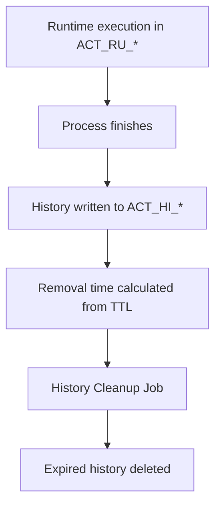
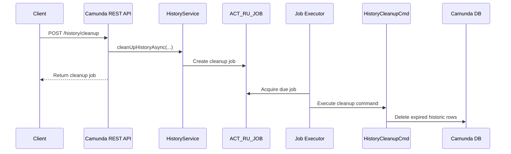
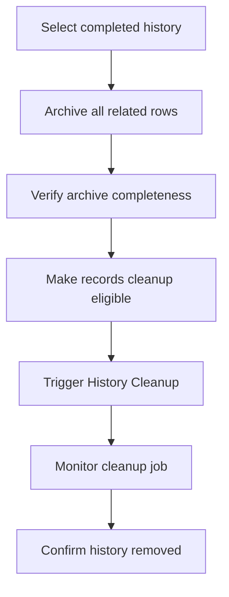

# Camunda History Cleanup Reference

This document explains how Camunda 7 History Cleanup works and how it relates to the archive project.

## 1. Purpose

Camunda History Cleanup deletes expired historic data from `ACT_HI_*` tables. It does not delete active runtime state from `ACT_RU_*` tables.



History Cleanup is useful for controlling Camunda database growth, but it is a delete mechanism, not an archive mechanism. Deleted rows cannot be restored by Camunda unless they were backed up or archived before cleanup.

## 2. Trigger Methods

Camunda supports two primary trigger paths.

| Trigger | Description |
| --- | --- |
| Automatic scheduler | The process engine creates cleanup jobs based on cleanup configuration and the configured batch window. The Job Executor runs those jobs asynchronously. |
| REST or Java API | A client can request cleanup by calling the History Cleanup REST API or the equivalent `HistoryService.cleanUpHistoryAsync(...)` Java API. |

REST example:

```http
POST /engine-rest/history/cleanup?immediatelyDue=true
```

`immediatelyDue=true` schedules the job for execution as soon as possible.
`immediatelyDue=false` schedules the job for the configured cleanup window.

The API response is the scheduled job, not the final deletion result.

## 3. Internal Cleanup Flow



Important internal concepts:

- Cleanup is asynchronous.
- Cleanup is performed by the Job Executor.
- Cleanup eligibility is based on TTL and removal time rules, not on archive-project metadata.
- Cleanup can delete from multiple history tables for each eligible historic root instance.

## 4. TTL and Removal Time

History Time To Live (TTL) is configured on process, decision, or case definitions. When a historic instance is created or completed, Camunda can calculate `REMOVAL_TIME_` from the configured TTL.

Example:

| Finished Date | TTL | Removal Time |
| --- | --- | --- |
| 2026-01-15 | 30 days | 2026-02-14 |

With the removal-time strategy, cleanup can use predicates similar to:

```sql
delete from ACT_HI_PROCINST
where REMOVAL_TIME_ <= current_timestamp;
```

Related history rows are removed according to Camunda's internal cleanup logic.

## 5. Tables Affected

Typical affected history tables include:

| Table | Purpose |
| --- | --- |
| `ACT_HI_PROCINST` | Historic process instances. |
| `ACT_HI_ACTINST` | Historic activity instances. |
| `ACT_HI_TASKINST` | Historic task instances. |
| `ACT_HI_VARINST` | Historic variable instances. |
| `ACT_HI_DETAIL` | Detailed variable updates and form properties. |
| `ACT_HI_COMMENT` | Historic comments. |
| `ACT_HI_ATTACHMENT` | Historic attachments. |
| `ACT_HI_INCIDENT` | Historic incidents. |
| `ACT_HI_JOB_LOG` | Historic job logs. |
| `ACT_HI_OP_LOG` | User operation log entries, when eligible. |
| `ACT_HI_IDENTITYLINK` | Historic identity links. |
| `ACT_HI_EXT_TASK_LOG` | Historic external task logs. |
| `ACT_HI_DECINST` | Historic decision instances. |
| `ACT_HI_DEC_IN` | Historic decision inputs. |
| `ACT_HI_DEC_OUT` | Historic decision outputs. |
| `ACT_HI_BATCH` | Historic batch metadata. |

Runtime tables such as `ACT_RU_EXECUTION`, `ACT_RU_TASK`, `ACT_RU_VARIABLE`, `ACT_RU_JOB`, and `ACT_RU_EVENT_SUBSCR` are not deleted by History Cleanup.

## 6. Filtering Limitations

The History Cleanup API does not accept filters such as:

- `processInstanceId`
- `processDefinitionId`
- `businessKey`
- `tenantId`

It cleans all eligible history according to configured cleanup criteria. To delete one historic process instance directly, use the historic process deletion API instead of History Cleanup.

## 7. Logging and Audit

Camunda does not create a dedicated history cleanup audit table listing every deleted row.

| Information | Location |
| --- | --- |
| Scheduled cleanup job | `ACT_RU_JOB` while pending. |
| Cleanup job execution | `ACT_HI_JOB_LOG` and engine logs. |
| Cleanup errors | `ACT_HI_JOB_LOG` and engine logs. |
| Deleted row counts | Usually engine logs, depending on logging configuration. |
| Deleted process ids | Not stored by Camunda as a built-in cleanup audit trail. |

For this archive project, the reliable audit trail is the archive database:

- `arc_archive_run`
- `archive_job`
- `archive_job_item`
- `archive_job_retry_history`
- `arc_restore_log`

## 8. Relationship to This Project

The current implemented archive flow is:

1. Select eligible history.
2. Copy related rows from Camunda history tables into archive tables.
3. Delete copied rows from Camunda history tables.
4. Record the archive run.

The project also documents an alternative cleanup-managed flow:

1. Select eligible history.
2. Copy related rows to the Archive database.
3. Validate archive completeness.
4. Make archived instances eligible for Camunda History Cleanup.
5. Trigger `POST /history/cleanup`.
6. Let Camunda delete eligible historic data.

In the current codebase, the scheduler method `cleanupCamundaHistory()` is a placeholder that logs that Camunda cleanup APIs should be called after archive validation. Therefore, direct delete-after-copy is the active implemented cleanup path, while Camunda History Cleanup integration is a documented extension path.

## 9. Recommended Operating Rule

Do not call History Cleanup before archive validation. If the estate adopts Camunda-managed cleanup, the safe sequence is:



This preserves recoverability while still allowing Camunda to perform the final deletion.
